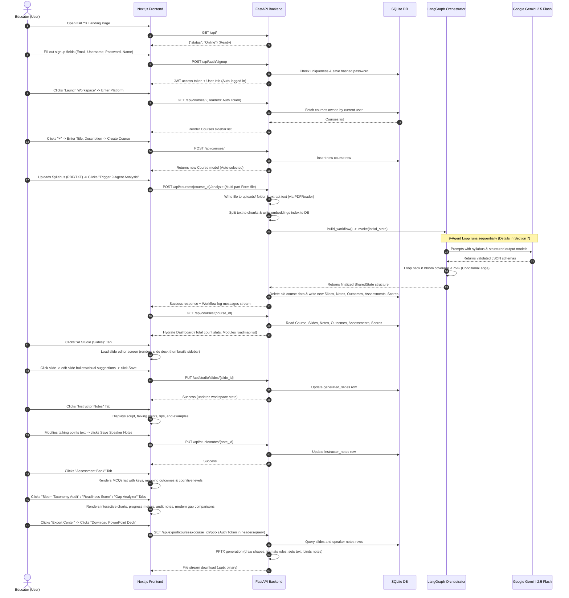

# KALYX Complete System Architecture & Functionality Audit

This document presents a comprehensive, end-to-end technical audit and architectural breakdown of the KALYX platform based on direct, read-only inspection of the codebase.

---

## SECTION 1 — Project Structure

### Workspace File Tree

```
kalyx/
├── backend/
│   ├── app/
│   │   ├── __init__.py
│   │   ├── database.py
│   │   ├── main.py
│   │   ├── models.py
│   │   ├── agents/
│   │   │   ├── __init__.py
│   │   │   ├── state.py
│   │   │   └── workflow.py
│   │   ├── routers/
│   │   │   ├── __init__.py
│   │   │   ├── auth.py
│   │   │   ├── courses.py
│   │   │   ├── export.py
│   │   │   └── studio.py
│   │   └── services/
│   │       ├── __init__.py
│   │       ├── exporter.py
│   │       └── rag_service.py
│   ├── exports/
│   ├── uploads/
│   ├── requirements.txt
│   └── kalyx.db
└── frontend/
    ├── src/
    │   └── app/
    │       ├── layout.tsx
    │       ├── page.tsx
    │       └── globals.css
    ├── tsconfig.json
    ├── package.json
    └── next.config.ts
```

### Major File Registry

| File Path | Purpose | Dependencies | Core Inputs | Core Outputs | Used By |
| :--- | :--- | :--- | :--- | :--- | :--- |
| [`backend/app/main.py`](file:///Users/devashishpandey/Documents/kalyx/backend/app/main.py) | Application entrypoint. Syncs database, registers CORS, mounts routers. | `FastAPI`, `SQLAlchemy`, `Uvicorn` | Port & Host Env variables | Running FastAPI server instance | Direct startup command |
| [`backend/app/models.py`](file:///Users/devashishpandey/Documents/kalyx/backend/app/models.py) | Database schema mappings using SQLAlchemy ORM. | `SQLAlchemy` | Base schemas declarations | SQL Tables models | All backend files |
| [`backend/app/database.py`](file:///Users/devashishpandey/Documents/kalyx/backend/app/database.py) | Database connection & session pool manager. | `SQLAlchemy` | Local SQLite URL (`sqlite:///./kalyx.db`) | Database Session pools | main.py, routers, workflow.py |
| [`backend/app/agents/workflow.py`](file:///Users/devashishpandey/Documents/kalyx/backend/app/agents/workflow.py) | Compiles the 9-agent LangGraph workflow, prompt templates, fallbacks, and LLM queries. | `langgraph`, `google-genai`, `Pydantic` | Syllabus text, personalization preferences | Final state dictionary with generated deck, assessments, notes | courses.py, studio.py |
| [`backend/app/agents/state.py`](file:///Users/devashishpandey/Documents/kalyx/backend/app/agents/state.py) | Defines the Pydantic type signatures for the LangGraph workspace. | `typing` | None | Pydantic model for state variables | workflow.py |
| [`backend/app/routers/auth.py`](file:///Users/devashishpandey/Documents/kalyx/backend/app/routers/auth.py) | Auth controller. Signups, JWT validation, logins, password crypts. | `bcrypt`, `pyjwt`, `FastAPI` | Password, Email, Visited scopes | JWT bearer tokens | main.py, other routers |
| [`backend/app/routers/courses.py`](file:///Users/devashishpandey/Documents/kalyx/backend/app/routers/courses.py) | Course manager. Handles syllabus uploads and execution. | `FastAPI`, `shutil`, `workflow.py` | Syllabus uploads, text fields | JSON metadata, execution logs | main.py |
| [`backend/app/routers/studio.py`](file:///Users/devashishpandey/Documents/kalyx/backend/app/routers/studio.py) | Workspace editor. Performs modifications to slides, notes, assessments, and customization setups. | `FastAPI`, `SQLAlchemy` | JSON update bodies | Mutation success status | main.py |
| [`backend/app/routers/export.py`](file:///Users/devashishpandey/Documents/kalyx/backend/app/routers/export.py) | Export trigger. Translates records into exports. | `FastAPI`, `csv`, `exporter.py` | Course ID tokens | Files downloads | main.py |
| [`backend/app/services/rag_service.py`](file:///Users/devashishpandey/Documents/kalyx/backend/app/services/rag_service.py) | Context loader. PDF parser, text chunker, local/Gemini vector index builder. | `pypdf`, `google-genai` | Uploaded document content | Vector matches | workflow.py, courses.py |
| [`backend/app/services/exporter.py`](file:///Users/devashishpandey/Documents/kalyx/backend/app/services/exporter.py) | Exporter engine. Generates Microsoft PowerPoint presentation decks and PDF packages. | `python-pptx`, `fpdf2` | JSON slides, notes, tests list | Physical file saved on disk | export.py |
| [`frontend/src/app/page.tsx`](file:///Users/devashishpandey/Documents/kalyx/frontend/src/app/page.tsx) | Whole frontend. Authentication forms, dashboard, interactive studio editors. | `React`, `Lucide Icons` | User actions, text updates | UI views, file requests | Next.js renderer |

---

## SECTION 2 — User Journey

Below is the step-by-step trace showing data exchanges, states, and components:



---

## SECTION 3 — Frontend Architecture

### Core Technologies
*   **Framework**: Next.js 15+ (using App Router model, single-page rendering).
*   **State Management**: Standard React hooks (`useState`, `useEffect`, dynamic context binding). States are fully synchronized with SQLite database responses.
*   **Styling**: Vanilla CSS alongside TailwindCSS utility styles mapping back to variables in [`globals.css`](file:///Users/devashishpandey/Documents/kalyx/frontend/src/app/globals.css). Uses dark mode palette defaults.
*   **Animations**: Custom keyframes for glass-panel glows, pulsed animations, fade-ins, and slides movement transitions.
*   **Icons**: Imported directly from `lucide-react`.

### Page Registry
The frontend is built inside a single page: [`frontend/src/app/page.tsx`](file:///Users/devashishpandey/Documents/kalyx/frontend/src/app/page.tsx). It handles routing internally by tracking the user's `view` ('landing' or 'workspace') and active tab panels.

| UI Panel Tab | Purpose | Local State Bound | APIs Triggered |
| :--- | :--- | :--- | :--- |
| **Auth Overlay** | Gates the application if no valid JWT token is saved in localStorage. | `authToken`, `authMode`, `user`, `authError` | `POST /api/auth/login`, `POST /api/auth/signup` |
| **Landing Hero Page** | Intro fold displaying platform goals and features. | `view`, `user` | None (redirects view to Workspace) |
| **Course Dashboard** | Summarizes total slide count, Bloom coverage, modules timeline map. | `courseDetails`, `courses` | `GET /api/courses/{course_id}`, `DELETE /api/courses/{course_id}` |
| **AI Studio (Slides)** | Slide editor. Displays layout preview cards, bullet fields, visual notes. | `activeSlideIndex`, `editSlideTitle`, `editSlideBullets`, `editSlideVisuals` | `PUT /api/studio/slides/{slide_id}`, `POST /api/studio/courses/{course_id}/personalize`, `POST /api/courses/{course_id}/regenerate` |
| **Instructor Notes** | Lecturing script, interactive tip notes, real-world examples list. | `editNoteTalkingPoints`, `editNoteTips`, `editNoteExamples` | `PUT /api/studio/notes/{note_id}` |
| **Assessment Bank** | MCQ question board. Displays questions, option details, solution keys. | `courseDetails` | `GET /api/export/courses/{course_id}/kahoot`, `GET /api/export/courses/{course_id}/interactive-quiz` |
| **Bloom Taxonomy Audit** | Charts 6 cognitive levels with coverage progress metrics. | `courseDetails` | `GET /api/courses/{course_id}` |
| **Readiness Score** | Displays overall readiness meter out of 100 with radar parameters. | `courseDetails` | `GET /api/courses/{course_id}` |
| **Industry Gap Analyzer** | Renders modern trends checklist, recommended updates summary. | `courseDetails` | `GET /api/courses/{course_id}` |
| **Export Center** | Downloader panel. Generates physical PPTX, PDF packages. | `courseDetails` | `GET /api/export/courses/{course_id}/pptx`, `GET /api/export/courses/{course_id}/pdf` |

---

## SECTION 4 — Backend Architecture

### FastAPI Design
The backend is a robust REST API written in FastAPI, configured with modular router controllers located inside `backend/app/routers/`.

### Endpoint Catalog

| Endpoint | Method | Security | Request Body | Response JSON / Output | Purpose |
| :--- | :--- | :--- | :--- | :--- | :--- |
| `/api/auth/signup` | POST | Public | `UserSignup` | `TokenResponse` | Creates User record, hashes password, returns JWT token. |
| `/api/auth/login` | POST | Public | `UserLoginSchema` | `TokenResponse` | Validates user password, generates JWT token. |
| `/api/courses/` | GET | Token | None | `List[CourseResponse]` | Returns all courses owned by the authenticated User. |
| `/api/courses/` | POST | Token | `CourseCreate` | `CourseResponse` | Creates a new Course. |
| `/api/courses/{course_id}` | GET | Token | None | `CourseDetails` | Fetches course metadata, curriculum mapping, outcomes, slides, speaker notes, assessments, and scores. |
| `/api/courses/{course_id}` | DELETE | Token | None | `{"message": "Course deleted"}` | Cascades and deletes all course-related database records. |
| `/api/courses/{course_id}/analyze` | POST | Token | Form-data (File) | `{"status": "Success", "logs": [...]}` | Parses syllabus upload, builds RAG indexes, runs the 9-agent LangGraph pipeline, and saves structured outputs. |
| `/api/courses/{course_id}/regenerate` | POST | Token | None | `{"status": "Success", "logs": [...]}` | Re-runs LangGraph workflow utilizing saved personalization profiles. |
| `/api/studio/slides/{slide_id}` | PUT | Token | `SlideUpdatePayload` | `{"status": "Success", ...}` | Updates GeneratedSlide row contents. |
| `/api/studio/notes/{note_id}` | PUT | Token | `NoteUpdatePayload` | `{"status": "Success", ...}` | Updates InstructorNote row contents. |
| `/api/studio/assessments/{a_id}` | PUT | Token | `AssessmentUpdatePayload`| `{"status": "Success"}` | Updates specific quiz question properties. |
| `/api/studio/courses/{c_id}/personalize` | POST | Token | `PersonalizationPayload`| `{"status": "Success", ...}` | Creates/updates Course personalization preferences. |
| `/api/export/courses/{c_id}/pptx` | GET | Token* | None | File Download (.pptx) | Compiles slides and speaker notes to PPTX presentation. |
| `/api/export/courses/{c_id}/pdf` | GET | Token* | None | File Download (.pdf) | Compiles slides, notes, and quiz bank to high-fidelity PDF. |
| `/api/export/courses/{c_id}/kahoot` | GET | Token* | None | File Download (.csv) | Formats MCQ assessment questions into Kahoot CSV import template. |
| `/api/export/courses/{c_id}/interactive-quiz`| GET | Token* | None | File Download (.html) | Formats quiz into self-hosted, Tailwind-styled, interactive HTML page. |

> [!NOTE]
> **Token\* Query Fallback**: Since standard browser file downloads (`window.open`) cannot easily pass Bearer Auth headers, these endpoints support extracting the token from either the HTTP `Authorization` Header or a query parameter `?token=...` inside [`get_current_user` dependencies check](file:///Users/devashishpandey/Documents/kalyx/backend/app/routers/auth.py#L56-L82).

---

## SECTION 5 — Database Design

### Database Engine
*   **Driver**: SQLALchemy connecting to local relational database.
*   **Local File**: `/Users/devashishpandey/Documents/kalyx/backend/kalyx.db` (SQLite).
*   **Schemas Sync**: Initialized automatically on FastAPI start via `Base.metadata.create_all(bind=engine)` inside [`backend/app/main.py`](file:///Users/devashishpandey/Documents/kalyx/backend/app/main.py).

### Textual ERD Model

```
  +------------------+
  |      users       |
  +------------------+
  | id (PK)          | <---+
  | email (Unique)   |     |
  | username         |     |
  | hashed_password  |     |
  | full_name        |     |
  | created_at       |     |
  +------------------+     |
                           | 1
                           |
                           | M
  +------------------+     |
  |     courses      |     |
  +------------------+     |
  | id (PK)          |     |
  | user_id (FK)     | ----+
  | title            |
  | description      |
  | created_at       |
  +------------------+
    |      |      |      |      |      |      |      |      |
    | 1    | 1    | 1    | 1    | 1    | 1    | 1    | 1    | 1
    |      |      |      |      |      |      |      |      |
    v M    v M    v M    v M    v M    v M    v M    v 1    v M
  +-----+ +-----+ +-----+ +-----+ +-----+ +-----+ +-----+ +-----+ +-----+
  | SLB | | CAN | | Lout| | Gsd | | Inot| | Asmt| | Rscr| | Prof| | Pexp|
  +-----+ +-----+ +-----+ +-----+ +-----+ +-----+ +-----+ +-----+ +-----+
  
  * Keys Map:
    - SLB: syllabi (M)
    - CAN: curriculum_analysis (M)
    - Lout: learning_outcomes (M)
    - Gsd: generated_slides (M)
    - Inot: instructor_notes (M)
    - Asmt: assessments (M) [has optional FK to learning_outcomes]
    - Rscr: readiness_scores (M)
    - Prof: instructor_personalization (1)
    - Pexp: ppt_exports (M)
```

### Table Registry Details

#### `users`
*   **Purpose**: Records credentials.
*   **Relationships**: `courses` (One-to-Many cascade delete).

#### `courses`
*   **Purpose**: Parent directory for generated assets.
*   **Relationships**: `user` (Many-to-One), all generated components (One-to-Many).

#### `syllabi`
*   **Purpose**: Retains uploaded curriculum content.
*   **Columns**: `id`, `course_id` (FK), `raw_text`, `file_name`, `file_path`, `uploaded_at`.

#### `curriculum_analysis`
*   **Purpose**: Logs the timeline roadmap.
*   **Columns**: `id`, `course_id` (FK), `curriculum_map` (JSON: modules & topics), `gap_analysis` (JSON), `industry_gap_report` (JSON), `created_at`.

#### `learning_outcomes`
*   **Purpose**: Mapped educational competencies.
*   **Columns**: `id`, `course_id` (FK), `outcome_text`, `bloom_level`.

#### `generated_slides`
*   **Purpose**: Contains slide presentation decks.
*   **Columns**: `id`, `course_id` (FK), `slide_index` (Int), `title`, `content` (JSON list of bullets), `suggested_visuals` (Text).

#### `instructor_notes`
*   **Purpose**: Contains speaker scripts.
*   **Columns**: `id`, `course_id` (FK), `slide_index` (Int), `talking_points` (JSON list of notes), `teaching_tips` (Text), `examples` (JSON list of scenarios).

#### `assessments`
*   **Purpose**: Stores generated quizzes.
*   **Columns**: `id`, `course_id` (FK), `learning_outcome_id` (FK to `learning_outcomes`, Nullable), `question_text`, `question_type` (MCQ, Short, etc.), `options` (JSON list), `correct_answer`, `bloom_level`.

#### `readiness_scores`
*   **Purpose**: Retains evaluated quality audit results.
*   **Columns**: `id`, `course_id` (FK), `score` (Float), `completeness` (Float), `outcome_coverage` (Float), `assessment_quality` (Float), `bloom_coverage` (Float), `industry_relevance` (Float), `breakdown` (JSON).

#### `uploaded_documents`
*   **Purpose**: Stores uploaded syllabus metadata for RAG indexing.
*   **Columns**: `id`, `course_id` (FK), `file_name`, `file_path`, `document_type`.

#### `embeddings`
*   **Purpose**: Stores text chunks vectors.
*   **Columns**: `id`, `document_id` (FK to `uploaded_documents`), `chunk_text`, `embedding` (JSON list of floats representing the 768/3072 dimension vector).

#### `instructor_personalization`
*   **Purpose**: Stores style choices.
*   **Columns**: `id`, `course_id` (FK), `profile` (JSON: tone, style preference).

---

## SECTION 6 — AI System Analysis

### LLM Specifications
*   **Library**: Google GenAI SDK (`google-genai` official release).
*   **Model**: `gemini-2.5-flash` for high-speed, cost-efficient curriculum processing.
*   **Temperature**: `0.2` (Low temperature enforces consistent output formatting).
*   **System Instructions**: Injected explicitly into `GenerateContentConfig` for role-playing context (e.g. Lead Reviewer, Instructional Designer).
*   **Structured Outputs**: Achieved by passing Pydantic classes (e.g., `SlideDeck`, `ReadinessScore`) to `response_schema` parameter in Google GenAI calls. Unsupported `additionalProperties` constraints are programmatically removed prior to execution.

### RAG and Embeddings
*   **Embedding Model**: `models/gemini-embedding-2` generating vector representations of document chunks.
*   **Vector Database**: In-memory cosine similarity matching running over SQLite JSON arrays fallback.

---

## SECTION 7 — LangGraph Workflow

The orchestrator utilizes **LangGraph** to build a structured multi-agent state graph pipeline.

```mermaid
graph TD
    START([START]) --> curriculum_analysis
    curriculum_analysis --> learning_outcome
    learning_outcome --> curriculum_planning
    curriculum_planning --> slide_generation
    slide_generation --> instructor_notes
    instructor_notes --> assessment_generation
    assessment_generation --> bloom_coverage
    
    bloom_coverage --> route_bloom{route_bloom_coverage}
    route_bloom -- Avg Bloom < 75% & loops < 1 --> learning_outcome
    route_bloom -- Otherwise --> readiness_score
    
    readiness_score --> gap_analyzer
    gap_analyzer --> END([END])

    style route_bloom fill:#1e1b4b,stroke:#818cf8,stroke-width:2px;
```



### Transition Schema & Edge Logic

*   **State Class**: `SharedState` (inherits from `TypedDict`) passes variables between agents:
    *   `course_id`: Target Database primary key.
    *   `syllabus_text`: The raw text of the parsed syllabus file.
    *   `curriculum_map`: Dictionary representation of modules and topics.
    *   `learning_outcomes`: List of outcome statements.
    *   `curriculum_plan`: Weekly roadmap matching target themes.
    *   `slide_deck`: JSON array representing slide content and layout visuals.
    *   `instructor_notes`: Script, interactive tip notes, and example scenarios list.
    *   `assessment_bank`:MCQ and short answer diagnostic questions.
    *   `bloom_report`: Bloom taxonomy breakdown stats.
    *   `readiness_score`: Radar parameters scorecard and comments.
    *   `industry_gap_report`: Checklist comparing topics against modern industrial trends.
    *   `personalization_profile`: Style and tone overrides.
    *   `logs`: Audit string trace.
    *   `current_agent`: Running workflow step tracker.
*   **Self-Healing Bloom Loop**: After `bloom_coverage` calculates cognitive coverage, `route_bloom_coverage` checks if the average coverage score is below 75%. If yes, and the loop hasn't run yet, it routes back to `learning_outcome` to re-extract and balance learning outcomes. Otherwise, it moves to `readiness_score`.
*   **Fallback Protections**: If Gemini API returns a rate limit exception or is offline, each agent catches the error and falls back to mock generator logic (derived from syllabus keywords like "machine learning" or "data"). This guarantees that the pipeline completes successfully.

---

## SECTION 8 — RAG Architecture

KALYX features a complete Retrieval-Augmented Generation (RAG) vector index pipeline inside [`backend/app/services/rag_service.py`](file:///Users/devashishpandey/Documents/kalyx/backend/app/services/rag_service.py).

### How RAG Works:
1.  **Text Chunking**: Syllabus text is divided into overlapping blocks of `500` characters, using an overlap boundary of `100` characters to maintain context.
2.  **Embedding Generation**: Chunks are sent to the `models/gemini-embedding-2` model to generate vectors.
    *   *Offline Fallback*: If the Gemini API key is missing, a local deterministic 768-dimension vector generator (using MD5 hashes of chunk text mapped onto sine curves) is used to ensure stability.
3.  **Vector Storage**: Vectors are stored directly inside the `embeddings` SQLite table as a JSON-serialized list of floats.
4.  **Retrieval Search**: During analysis, queries (e.g. `modern industrial requirements`) are embedded, and an in-memory cosine similarity search runs over all document embeddings.
5.  **Agent Integration**: The RAG context is injected into Agent 8 (Readiness Score) and Agent 9 (Curriculum Gap Analyzer) to cross-reference the syllabus against professional guidelines.

---

## SECTION 9 — Slide Generation System

Slide generation is managed by Agent 4 (`slide_generation_agent`) and the physical compilation is done by the backend exporter.

### Generation Pipeline
*   **Inputs**: Course syllabus, curriculum map, personalization profiles (e.g., tone and style overrides).
*   **Processing**:
    1.  The agent receives instructions mapping out the course into exactly 20 slides.
    2.  Prompts the LLM with the `SlideDeck` schema to generate:
        *   `slide_index`: Page index.
        *   `title`: Concept header.
        *   `content`: 3-5 bullet points.
        *   `suggested_visuals`: Graphic visual instructions.
*   **PPTX Compilation**:
    *   Uses `python-pptx` to build presentations from a blank layout, giving full programmatic control over size and position.
    *   Implements a premium dark-navy theme (`#0a0f1e` background, `#0ea5e9` cyan highlights, `#e2e8f0` light gray body text, `#141c37` glassmorphic cards).
    *   Draws visual suggestions inside a card layout on the right.
    *   If a slide contains code snippets, it automatically renders them inside a dark terminal block using monospace fonts and mint-green syntax coloring.

---

## SECTION 10 — Instructor Notes System

Instructor notes are generated by Agent 5 (`instructor_notes_agent`) using the `InstructorNotesList` schema.

### Data Flow & Execution Parameters:
*   **Objective**: Compiles lecturing guidelines to ensure the slides are easy to present.
*   **Output Requirements**:
    *   *Talking Points*: Generates a list of detailed talking points for each slide.
    *   *Teaching Tips*: Compiles interactive whiteboard layout guidelines and student engagement prompts.
    *   *Clarifying Examples*: Generates concrete real-world scenarios.
*   **Database Record**: Stores notes inside the `instructor_notes` table, linked by `course_id` and `slide_index`.
*   **Physical Binder**: Binds notes directly into the PPTX slide notes section, so presenters can view them in presenter mode.

---

## SECTION 11 — Assessment System

Quizzes are generated by Agent 6 (`assessment_generation_agent`) using the `AssessmentBank` schema.

### Assessment Specifications:
*   **Tiers**: Mapped to Bloom's Taxonomy cognitive tiers.
*   **Relational Binding**: Dynamically linked back to extracted learning outcomes.
*   **Output JSON Schema**:
    *   `question_text`: String.
    *   `question_type`: "MCQ" or "Short Answer".
    *   `options`: Array of options if it is an MCQ.
    *   `correct_answer`: Answer key matching the options.
    *   `bloom_level`: Cognitive tier label.
    *   `learning_outcome_id`: Target outcome index.
*   **Exports**:
    *   *Kahoot*: Exports MCQs into a CSV template, with correct answer options mapped to 1-based indices.
    *   *Interactive HTML*: Bundles Tailwind CSS, slide animations, and local Javascript to output a standalone interactive quiz app.

---

## SECTION 12 — Bloom Taxonomy Engine

Cognitive coverage mapping is managed by Agent 7 (`bloom_coverage_agent`) and the conditional routing edge.

### Core Architecture:
*   **Bloom Tiers Evaluated**: *Remembering*, *Understanding*, *Applying*, *Analyzing*, *Evaluating*, *Creating*.
*   **Scoring Process**: The agent scans outcomes and assessments, calculates the percentage coverage for each tier, and computes the average cognitive coverage score.
*   **Self-Healing Loop**: If average coverage is below 75%, it triggers a feedback loop back to Agent 2 to enrich and re-balance the outcomes. It logs the audit trace: `"Audit Alert: Higher-order Bloom cognitive coverage is below 75%. Triggering self-healing feedback loop..."` (capped at 1 loop iteration to prevent infinite cycles).

---

## SECTION 13 — Readiness Score System

The readiness score calculation is a **hybrid programmatic and LLM-driven** system managed by Agent 8 (`readiness_score_agent`).

### Readiness Calculation Pipeline:
1.  **Programmatic Baseline Calculation**:
    *   The system calculates baseline weights based on physical deliverables:
        *   `completeness` (20% weight): Scaled based on slide count.
        *   `outcome_coverage` (25% weight): Mapped outcomes count.
        *   `assessment_quality` (20% weight): Assessments count.
        *   `bloom_coverage` (20% weight): Calculated Bloom average.
        *   `industry_relevance` (15% weight): Modern trends compatibility.
2.  **LLM Refinement Step**:
    *   The baseline parameters and RAG compliance context are passed to the `readiness_score_agent`.
    *   The agent acts as an Accreditation Board Reviewer, refining the score and compiling qualitative audit summaries for each category.
3.  **Output JSON format**:
    *   `score`: Overall final rating (Float).
    *   `breakdown`: Dictionary mapping criteria to detailed critique strings.

---

## SECTION 14 — Industry Gap Analyzer

The gap analyzer is an **LLM-driven agent** running over retrieved RAG chunks.

### Modernization Pipeline:
*   **Agent Role**: Silicon Valley Tech Lead and Curriculum Modernization Lead.
*   **Inputs**: Curriculum map, syllabus text, and RAG search results containing modern industry standards.
*   **Processing**:
    *   The agent identifies missing tools, paradigms, and skills in the syllabus.
    *   Generates recommendations to modernize the course.
*   **Outputs**:
    *   `status`: Modernization status indicator (e.g. "Modern", "Needs Update").
    *   `missing_topics`: List of topics to add.
    *   `recommendations`: Authoritative guidelines for update steps.

---

## SECTION 15 — Authentication System

KALYX features a secure JWT-based authentication system implemented in [`backend/app/routers/auth.py`](file:///Users/devashishpandey/Documents/kalyx/backend/app/routers/auth.py).

### Authentication Details:
*   **Password Encryption**: Uses `bcrypt` to hash and verify passwords.
*   **Token Generation**: Encodes tokens using PyJWT with `HS256` signature algorithm.
*   **Token Expiry**: Configured to `1440` minutes (24 hours) by default.
*   **Route Protection**:
    *   Uses FastAPI dependencies (`Depends(get_current_user)`) to restrict endpoint access.
    *   Extracts tokens from the HTTP `Authorization` header (`Bearer <token>`).
    *   Supports a query parameter fallback (`?token=<token>`) for browser file downloads.

---

## SECTION 16 — Gemini Integration

All Gemini integration code is contained in [`backend/app/agents/workflow.py`](file:///Users/devashishpandey/Documents/kalyx/backend/app/agents/workflow.py) and [`backend/app/services/rag_service.py`](file:///Users/devashishpandey/Documents/kalyx/backend/app/services/rag_service.py).

### Verification Table

| Component | Target Integration | File Locations | Code Reference |
| :--- | :--- | :--- | :--- |
| **Model** | `gemini-2.5-flash` | `workflow.py` | `model='gemini-2.5-flash'` in `call_llm` |
| **Embeddings** | `models/gemini-embedding-2` | `rag_service.py` | `model="models/gemini-embedding-2"` in `get_embedding` |
| **Library** | `google-genai` (Official GenAI SDK) | `workflow.py`, `rag_service.py` | `from google import genai` |
| **Client Call** | `client.models.generate_content` | `workflow.py` | `client.models.generate_content(...)` |
| **JSON Schema** | Pydantic model validation | `workflow.py` | `response_schema=response_schema` in config options |

---

## SECTION 17 — Runtime Diagnostics

1.  **SQLite Database Lock Contention**:
    *   *Diagnostic*: Simultaneous writes during file indexing and LangGraph runs can trigger lock exceptions in SQLite.
    *   *Mitigation*: Handled by running connection pools with `SessionLocal` scope blocks.
2.  **Token Limit Bounds**:
    *   *Diagnostic*: Large syllabus documents can swell token payloads in the LangGraph state.
    *   *Mitigation*: Chunks indexing keeps search targets compact.
3.  **Local API Key Fallback Safety**:
    *   *Diagnostic*: Rate limits or missing API keys could block the pipeline.
    *   *Mitigation*: Validated fallback mock data generators ensure the frontend UI continues to function correctly.

---

## SECTION 18 — Feature Matrix

| Feature | Exists | Functional | Partially Functional | Mocked | Primary Responsible Files |
| :--- | :---: | :---: | :---: | :---: | :--- |
| **Course Storage** | Yes | Yes | - | - | `models.py`, `routers/courses.py` |
| **Slides Generator** | Yes | Yes | - | Fallback | `workflow.py`, `routers/courses.py` |
| **Instructor Notes** | Yes | Yes | - | Fallback | `workflow.py`, `routers/courses.py` |
| **Assessments** | Yes | Yes | - | Fallback | `workflow.py`, `routers/courses.py` |
| **Bloom Audit** | Yes | Yes | - | Fallback | `workflow.py`, `routers/courses.py` |
| **Readiness Score** | Yes | Yes | - | Fallback | `workflow.py`, `routers/courses.py` |
| **Gap Analysis** | Yes | Yes | - | Fallback | `workflow.py`, `routers/courses.py` |
| **PPTX Export** | Yes | Yes | - | - | `services/exporter.py`, `routers/export.py` |
| **RAG Indexing** | Yes | Yes | - | Fallback | `services/rag_service.py` |
| **Authentication**| Yes | Yes | - | - | `routers/auth.py` |

---

## SECTION 19 — Hackathon Demo Narrative

KALYX simplifies the transition from a raw syllabus to classroom-ready materials:

1.  **Upload (0:00 - 1:00)**: The educator uploads a syllabus document (PDF/TXT). The backend processes the document, creates RAG vectors, and indexes them in the database.
2.  **Analysis (1:00 - 3:00)**: The 9-agent LangGraph pipeline runs:
    *   Deconstructs content into structural modules.
    *   Maps outcomes and compiles lesson roadmaps.
    *   Generates slide decks and speaker talking points.
    *   Runs the Bloom Taxonomy audit and calculates the Readiness Score.
3.  **Review (3:00 - 5:00)**: Displays curriculum readiness, quizzes, and modern trends gap comparisons. Educators can modify slide content and download the PPTX or PDF packages immediately.

---

## SECTION 20 — Executive Summary

### Key Strengths
*   **Structured Outputs**: Using Pydantic validation schemas with Google GenAI ensures database writes are reliable.
*   **Orchestration**: The 9-agent LangGraph pipeline provides structured analysis step logs.
*   **Exports**: The exporter supports PPTX, PDF, Kahoot CSV, and interactive HTML.

### Opportunities for Scale
*   **Database**: Migrating from SQLite to PostgreSQL would improve concurrent write support.
*   **Orchestration**: Running agent tasks in parallel (e.g. assessments and notes generation) would decrease execution latency.
*   **Storage**: Moving uploaded files to object storage (like AWS S3) would make the server stateless.
