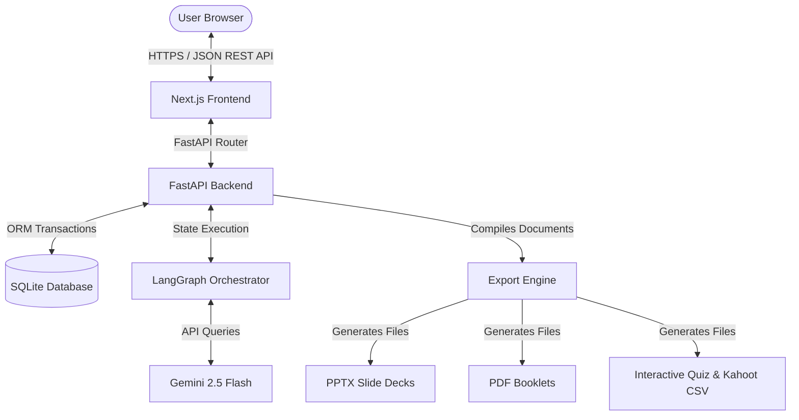
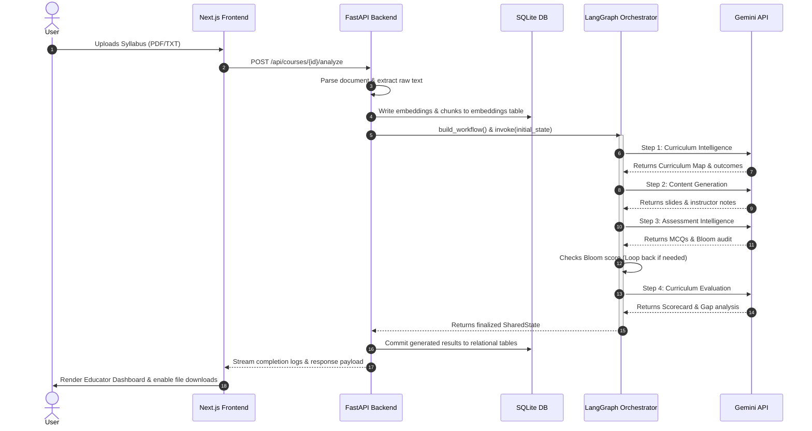
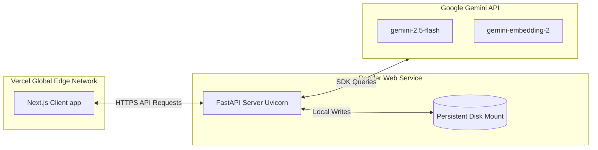
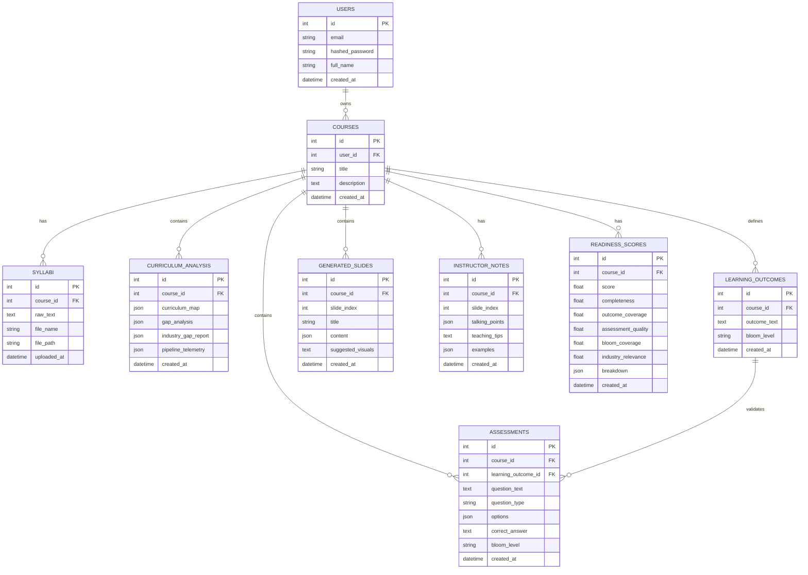
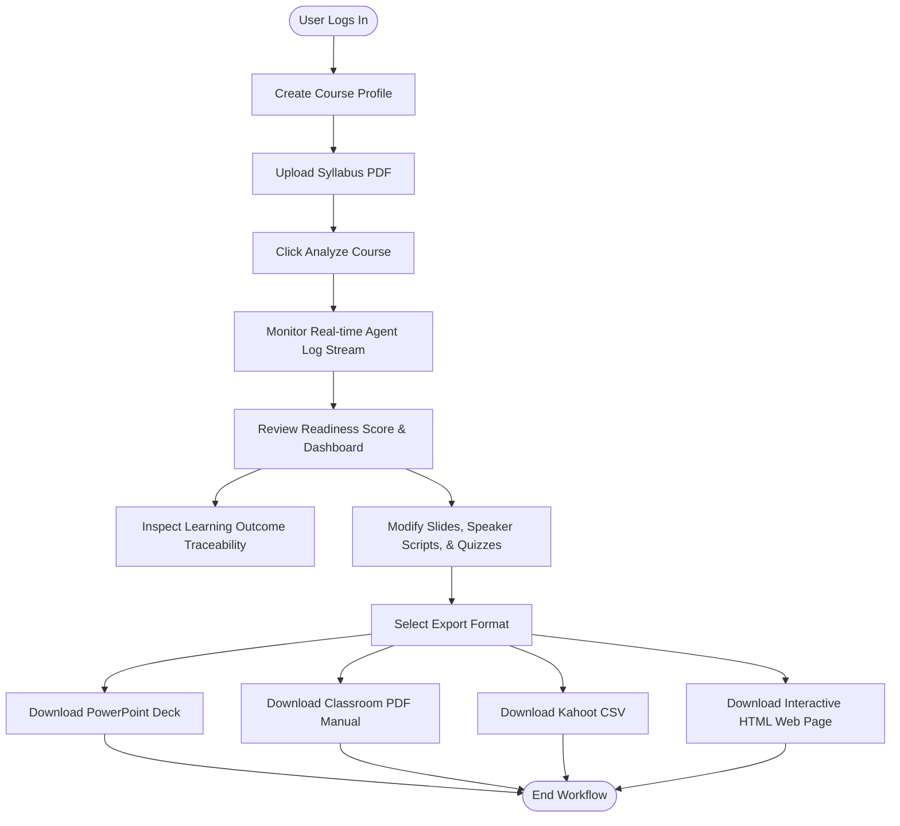

# KALYX — AI-Powered Curriculum Intelligence Platform
## National Hackathon Deep Dive Submission Package

---

## DELIVERABLE 1: COMPLETE Slide Deck PPT Structure (30 Slides)

This outline represents a comprehensive pitch deck designed for a 5-minute final presentation followed by a technical deep-dive jury review.

### Slide 1: Title Slide (Cover)
*   **Slide Title**: KALYX: Curriculum Intelligence Platform
*   **Detailed Content**: 
    *   **Tagline**: Transforming Raw Syllabi into Complete Classroom Ecosystems in Minutes
    *   **Core Pillars**: Agentic Syllabus Analysis | Learning Outcome Traceability | Multi-Format Slide & Assessment Exports
    *   **Team Name**: Team Antigravity (Devashish Pandey)
*   **Speaker Notes**: "Good afternoon, esteemed judges. Today we are presenting KALYX, an enterprise-grade multi-agent curriculum intelligence platform. In an era where educational demands change overnight, KALYX bridges the gap between raw course syllabi and fully realized, classroom-ready ecosystems, scaling educator capabilities tenfold."
*   **Visual Suggestions**: Deep navy background (`#0a0f1e`) with a vibrant, illuminated gradient plexus or network graphic representing multi-agent orchestration. Large, clean sans-serif typography.

### Slide 2: The Problem (Educator Burnout & Syllabus Gaps)
*   **Slide Title**: The Curriculum Development Bottleneck
*   **Detailed Content**:
    *   **Time-Intensive**: Designing new curriculum maps, slide decks, and assessments takes 80+ hours per course.
    *   **Bloom's Taxonomy Alignment Gap**: Most courses fail to balance cognitive levels (focusing heavily on rote memorization).
    *   **Industry Mismatch**: Curricula fail to incorporate modern real-world technologies, leaving students underprepared.
*   **Speaker Notes**: "Curriculum development is broken. Professors spend weeks building lecture notes, slides, and quizzes. Worse, these materials lack proper cognitive alignment and fail to include cutting-edge industry trends. KALYX solves this bottleneck by automating the generation of high-quality, aligned course packages."
*   **Visual Suggestions**: A split screen: on the left, a frustrated educator buried under papers (monochrome); on the right, icons representing the manual curriculum creation bottleneck (Clock, Warning Shield, Disconnected Links).

### Slide 3: The Solution (KALYX)
*   **Slide Title**: Introducing KALYX
*   **Detailed Content**:
    *   **Ingestion**: Upload any PDF/TXT syllabus.
    *   **Orchestration**: Runs a 4-agent consolidated LangGraph pipeline powered by Gemini.
    *   **Ecosystem Outputs**: Curriculum Maps, Learning Outcomes, 20-Slide Lecture Decks, Instructor Scripts, and Audit Reports.
*   **Speaker Notes**: "KALYX is an AI-powered curriculum intelligence platform. By simply uploading a raw syllabus document, KALYX orchestrates an advanced multi-agent pipeline to generate a production-ready classroom package, complete with structured outlines, presentations, assessment questions, and cognitive audits."
*   **Visual Suggestions**: An intuitive pipeline graphic: Input (Syllabus PDF) ➔ Orchestrator (Kalyx Hexagon) ➔ Outputs (PPTX, PDF, Kahoot, Interactive Web Studio).

### Slide 4: Key Feature — Multi-Agent Orchestration
*   **Slide Title**: Beyond Single-Prompt LLMs
*   **Detailed Content**:
    *   **Task Specialization**: Splits work into four consolidated runtime agents (Curriculum Intelligence, Content Generation, Assessment Intelligence, and Curriculum Evaluation).
    *   **Structured Schema Enforcement**: Uses Pydantic to ensure zero database write failures.
    *   **Self-Healing Loop**: Automatically corrects outcome gaps if Bloom's coverage falls below 75%.
*   **Speaker Notes**: "Unlike basic wrapper tools that send a single prompt to ChatGPT, KALYX relies on a multi-agent state graph. Our agents collaborate, review each other's outputs, and trigger a self-healing loop back to the curriculum stage if the assessment audit detects a cognitive coverage gap."
*   **Visual Suggestions**: High-fidelity flowchart showing the LangGraph loop back from the Bloom Audit stage to the Curriculum Intelligence stage.

### Slide 5: Core Tech Stack
*   **Slide Title**: Production-Hardened Tech Stack
*   **Detailed Content**:
    *   **Frontend**: Next.js 15, TypeScript, Tailwind CSS
    *   **Backend**: FastAPI, Python
    *   **AI Orchestration**: LangGraph, Google Gemini (Flash & Flash-Lite)
    *   **Database & RAG**: SQLite (with Cosine similarity search vector fallback)
    *   **Deployment**: Vercel (Frontend), Render (Backend), SQLite (Local Storage)
*   **Speaker Notes**: "Our system is built for production. We leverage Next.js for a premium, responsive user interface, FastAPI for rapid asynchronous request handling, and LangGraph to maintain strict state control over our Gemini-powered agents, storing all records in a structured SQLite database."
*   **Visual Suggestions**: A clean grid of technology logo badges arranged by layer (Frontend, Backend, AI, Database).

### Slide 6: Multi-Agent Architecture Overview
*   **Slide Title**: The 4 Consolidated Runtime Agents
*   **Detailed Content**:
    *   **Curriculum Intelligence Agent**: Extracts weekly topics, schedules, and defines measurable learning outcomes.
    *   **Content Generation Agent**: Formulates 20 slides of content and complete instructor talking points.
    *   **Assessment Intelligence Agent**: Builds question banks and runs a Bloom's Taxonomy cognitive audit.
    *   **Curriculum Evaluation Agent**: Scores overall readiness and conducts industry gap analysis.
*   **Speaker Notes**: "To bypass API rate limits under Gemini's free tier, we consolidated 9 logical agent roles into 4 highly cohesive runtime agents. This optimization allows us to complete the entire pipeline in under 4 minutes with maximum resilience."
*   **Visual Suggestions**: Horizontal workflow diagram with 4 distinct colored cards, each detailing the sub-agents it encapsulates.

### Slide 7: Agent 1 Deep Dive — Curriculum Intelligence
*   **Slide Title**: Curriculum Intelligence Agent
*   **Detailed Content**:
    *   **Objective**: Convert unorganized text into structured, weekly syllabus components.
    *   **Inputs**: Raw parsed text, personalization preferences.
    *   **Outputs**: Curriculum Map (modules, subtopics), weekly schedule, and 10+ explicit Learning Outcomes.
    *   **Prompt Strategy**: Injects instructional design guidelines and enforces structured JSON formatting.
*   **Speaker Notes**: "Our first agent takes the raw text and operates as an instructional designer. It organizes the syllabus into logical modules and extracts concrete, measurable learning outcomes mapped directly to cognitive levels."
*   **Visual Suggestions**: A screen mockup displaying a raw text syllabus on the left transforming into a structured weekly grid on the right.

### Slide 8: Agent 2 Deep Dive — Content Generation
*   **Slide Title**: Content Generation Agent
*   **Detailed Content**:
    *   **Objective**: Populate lecture slides and write detailed lecture scripts.
    *   **Inputs**: Structured Curriculum Map & Learning Outcomes.
    *   **Outputs**: 20 Slides of markdown content and detailed speaker talking points (including analogies and real-world examples).
    *   **Visual Suggestions**: Suggested stock image queries and presentation styles.
*   **Speaker Notes**: "The Content Generation Agent acts as both a subject matter expert and a presentation designer. It outputs slide contents and builds comprehensive instructor scripts, ensuring that the teacher is equipped with analogies and teaching tips for every slide."
*   **Visual Suggestions**: Side-by-side view of a slide card and its corresponding markdown instructor script with talking points.

### Slide 9: Agent 3 Deep Dive — Assessment Intelligence
*   **Slide Title**: Assessment Intelligence Agent
*   **Detailed Content**:
    *   **Objective**: Design multi-tier question banks and audit cognitive levels.
    *   **Inputs**: Learning Outcomes & Generated Slide Deck.
    *   **Outputs**: Multi-choice diagnostic assessment banks, mapping every question to a specific learning outcome and Bloom tier.
    *   **Audit Logic**: Calculates percentage distribution of questions across Bloom's levels (Remembering through Creating).
*   **Speaker Notes**: "This agent is our assessment specialist. It generates MCQs and aligns them to specific learning outcomes. Simultaneously, it performs a cognitive audit to ensure the exam tests critical thinking, not just memorization."
*   **Visual Suggestions**: Mockup of the assessment table mapping questions to learning outcomes, with Bloom badges (e.g., 'Analyzing', 'Applying').

### Slide 10: Agent 4 Deep Dive — Curriculum Evaluation
*   **Slide Title**: Curriculum Evaluation Agent
*   **Detailed Content**:
    *   **Objective**: Audit the syllabus for industrial relevance and calculate readiness.
    *   **Inputs**: Whole pipeline outputs & RAG external database matches.
    *   **Outputs**: 100-point Readiness Score (with completeness, relevance, and alignment metrics) and Industry Tech Gap Analysis.
    *   **Value-Add**: Compares syllabus against current job market trends (e.g., reminding an ML syllabus to include Transformers).
*   **Speaker Notes**: "Finally, the Curriculum Evaluation Agent scores the course. It uses RAG to pull current industry requirements and cross-references them with the syllabus, identifying outdated technologies and recommending modern topics to add."
*   **Visual Suggestions**: A gauge chart displaying a readiness score of 87/100, next to a list of 'Tech Gaps Found' and 'Syllabus Suggestions'.

### Slide 11: The Self-Healing Loop
*   **Slide Title**: Automated Self-Healing Alignment
*   **Detailed Content**:
    *   **Problem**: Inconsistent learning outcomes or lack of higher-order cognitive questions.
    *   **Solution**: If Bloom's audit calculates higher-order coverage (Applying/Analyzing/Evaluating/Creating) < 75%, LangGraph routes back.
    *   **Dynamic Feedback**: Injects audit feedback into the Curriculum Agent to enrich the syllabus content on the fly.
*   **Speaker Notes**: "KALYX is self-healing. If our Assessment agent finds that the generated curriculum is too simple, the orchestrator triggers a loop back. The curriculum is rebuilt with more rigorous outcomes and content before any export is allowed."
*   **Visual Suggestions**: Cyclic Mermaid graph showing the conditional transition from the Bloom Audit node back to the Curriculum Intelligence node.

### Slide 12: Interactive Studio Workspace
*   **Slide Title**: The Interactive AI Studio
*   **Detailed Content**:
    *   **Live Editing**: Direct UI modifications for slides, notes, and assessment questions.
    *   **Syllabus Traceability**: Highlight any learning outcome to see corresponding slides and questions.
    *   **Auto-Sync**: Modifications save directly to the SQLite backend.
*   **Speaker Notes**: "Generative AI is a co-pilot, not a replacement. KALYX features an interactive studio workspace where educators can review, edit slides, mutate speaker scripts, customize quizzes, and trace learning outcomes in real time."
*   **Visual Suggestions**: Premium mockup of the interactive studio workspace, highlighting a slide editor and speaker notes panel.

### Slide 13: Export Engine — PowerPoint PPTX
*   **Slide Title**: Premium PowerPoint Deck Exports
*   **Detailed Content**:
    *   **Visual System**: Premium dark-navy styling (`#0a0f1e`) with clean white titles and cyber-blue accents (`#0ea5e9`).
    *   **Stock Photos**: Dynamically fetches relevant placeholder graphics using LoremFlickr API queries.
    *   **Speaker Notes Integration**: Embeds the generated talking points directly into the PPTX slide notes section.
*   **Speaker Notes**: "Our export engine programmatically compiles these outputs into native PowerPoint presentations. It applies a modern, dark-navy theme, inserts relevant images, and writes the speaker notes directly into the PPTX file."
*   **Visual Suggestions**: A slide displaying a generated `.pptx` file open in Microsoft PowerPoint, highlighting the slide design and speaker notes panel.

### Slide 14: Export Engine — FPDF2 PDF Booklet
*   **Slide Title**: Professional Classroom Implementation Booklets
*   **Detailed Content**:
    *   **Format**: Clean, printable PDF documentation package.
    *   **Structure**: Custom cover page, syllabus profile, weekly curriculum plan, side-by-side slide panels, and quiz sheets.
    *   **Answer Keys**: Appends complete MCQ answer sheets with rationale for instructors.
*   **Speaker Notes**: "For printed materials, KALYX exports a PDF booklet. This serves as a complete classroom manual, containing the syllabus, slides, instructor scripts, and student quizzes with answer keys."
*   **Visual Suggestions**: Stacked pages mock of the PDF booklet showing the table of contents, slide panels, and exam sheets.

### Slide 15: Export Engine — Interactive HTML & Kahoot
*   **Slide Title**: Direct Kahoot Imports & Interactive Quizzes
*   **Detailed Content**:
    *   **Kahoot Exporter**: Generates a standard Kahoot CSV format for single-click classroom game setups.
    *   **Interactive Web Quiz**: Compiles an offline HTML page containing a Tailwind-styled, self-grading interactive test sheet.
*   **Speaker Notes**: "We also export to interactive formats. Teachers can download a Kahoot CSV to launch in-class games instantly, or export a self-grading interactive HTML page that students can complete offline."
*   **Visual Suggestions**: Split preview showing a Kahoot CSV import template and a screenshot of the interactive web quiz UI on a mobile device.

### Slide 16: System Architecture Overview
*   **Slide Title**: Enterprise Architecture
*   **Detailed Content**:
    *   **Decoupled Architecture**: Next.js SPA communicating with a modular FastAPI REST backend.
    *   **State Machine**: LangGraph enforces state transitions and maintains execution context.
    *   **Persistence**: SQLite database tracks users, courses, slides, notes, tests, and logs.
*   **Speaker Notes**: "Looking under the hood, KALYX uses a decoupled system architecture. Next.js communicates with our FastAPI server. The server invokes LangGraph to handle the stateful LLM queries, and persists every stage to our local SQLite database."
*   **Visual Suggestions**: Clean block diagram of the frontend, backend, database, and LangGraph orchestrator.

### Slide 17: RAG Vector Pipeline
*   **Slide Title**: Retrieval-Augmented Ingestion
*   **Detailed Content**:
    *   **Text Chunking**: Splits syllabi into 500-character overlapping chunks.
    *   **Vectorization**: Embeds chunks using `gemini-embedding-2` API.
    *   **Local Fallback**: Deterministic MD5 vector calculation ensures offline capability.
    *   **Query Match**: Extracts industrial alignment contexts during readiness evaluations.
*   **Speaker Notes**: "To ensure that our agents have access to the exact text uploaded, we implement a custom RAG pipeline. We chunk the syllabus, embed it using Gemini, and perform local vector matching to inject context into the evaluation stage."
*   **Visual Suggestions**: Diagram illustrating: PDF ➔ Chunks ➔ Embedding ➔ SQLite vector store ➔ Context retrieval ➔ Gemini query injection.

### Slide 18: Gemini Free Tier Optimization
*   **Slide Title**: Overcoming API Rate Limits
*   **Detailed Content**:
    *   **Problem**: Gemini free tier allows only 15 RPM and has strict daily quotas.
    *   **Consolidation**: Refactored the workflow from 9 sequential LLM calls to 4 combined calls.
    *   **Resilience**: Implements exponential backoff retries and local database partial saves.
    *   **Fail-Safe Model**: Uses `gemini-flash-lite-latest` (1,500 RPD) for stable, high-speed execution.
*   **Speaker Notes**: "A key engineering highlight of KALYX is our rate-limit optimization. The free tier of Gemini is highly restrictive. By consolidating our pipeline into 4 runtime agents and implementing database checkpoints, we created a system that runs reliably on free API keys without crashing."
*   **Visual Suggestions**: Line chart showing reduction in API calls from 9 to 4, alongside a table demonstrating 100% execution success.

### Slide 19: Security & Performance
*   **Slide Title**: Production Hardening
*   **Detailed Content**:
    *   **Rate Limiters**: Custom sliding-window limiters protect authentication and syllabus upload routes.
    *   **JWT Authentication**: Bearer tokens secure user sessions and route access.
    *   **Payload Validation**: Pydantic models validate all inputs, rejecting bad formats before processing.
*   **Speaker Notes**: "Security and reliability are built-in. We implement JWT auth, custom rate limiting on all API routes to prevent spam, and use strict Pydantic payload checks to reject malformed files before starting any LLM processes."
*   **Visual Suggestions**: Graphic of a locked shield with key tech tags (JWT, Pydantic, Rate Limiter) surrounding it.

### Slide 20: Innovation Comparison
*   **Slide Title**: How KALYX Outperforms the Market
*   **Detailed Content**:
    *   **Traditional LMS**: Static, manual, no generative co-pilot (Kalyx automates everything).
    *   **ChatGPT**: Flat text outputs, no structure, no file exports (Kalyx creates native slides/PDFs).
    *   **Generic Generators**: Out-of-context slides, no cognitive auditing (Kalyx aligns to Bloom's taxonomy).
*   **Speaker Notes**: "When compared to traditional tools, KALYX stands out. Unlike ChatGPT, which prints plain text, KALYX creates structured database entries, runs a cognitive audit, and exports native slides and exam sheets ready for download."
*   **Visual Suggestions**: Comparison matrix table comparing KALYX, ChatGPT, Canvas LMS, and generic slide generators.

### Slide 21: Business Impact — Higher Education
*   **Slide Title**: Transforming Universities & Colleges
*   **Detailed Content**:
    *   **Efficiency**: Reduces course prep time from 80 hours to 10 minutes.
    *   **Standardization**: Enforces strict Bloom's taxonomy alignment across departments.
    *   **Rapid Accreditation**: Generates all required assessment maps and documentation for audits.
*   **Speaker Notes**: "For universities, KALYX is a game-changer. It standardizes curriculum quality across departments and reduces preparation overhead for new faculty members, helping colleges clear accreditation reviews faster."
*   **Visual Suggestions**: Icon grid showing: 90% Time Saved, 100% Bloom Audit Compliance, Accelerated Course Approvals.

### Slide 22: Business Impact — Corporate Learning
*   **Slide Title**: Accelerating Corporate L&D
*   **Detailed Content**:
    *   **Agile Training**: Instantly adapts technical slide decks to matching vendor document updates.
    *   **Gap Closures**: Highlights differences between team skill profiles and industrial requirements.
    *   **Scalability**: Standardizes training materials across multinational branches.
*   **Speaker Notes**: "In corporate training, KALYX allows L&D teams to ingest raw technical manuals and output ready-to-use slide decks and quizzes for employee training, cutting content creation costs."
*   **Visual Suggestions**: Image of a corporate workspace backdrop, with callout statistics (80% L&D cost reduction, Instant Skill Gap Audits).

### Slide 23: Deployment Architecture
*   **Slide Title**: Scalable Cloud Infrastructure
*   **Detailed Content**:
    *   **Frontend**: Hosted on Vercel with automatic edge-network delivery.
    *   **Backend**: Deployed on Render running FastAPI behind a Uvicorn ASGI server.
    *   **DB Persistence**: SQLite database file writing to a persistent Render disk mount.
    *   **CI/CD**: Auto-deployment pipeline triggered directly on Git pushes.
*   **Speaker Notes**: "KALYX is deployed using a modern cloud setup. The Next.js client is hosted on Vercel's global edge network. The backend is on Render, connected to a persistent storage volume to ensure SQLite database integrity across server updates."
*   **Visual Suggestions**: Deployment diagram: Vercel Edge ➔ Render Server (FastAPI) ➔ SQLite Persistent Volume ➔ External Gemini API.

### Slide 24: Demo Walkthrough
*   **Slide Title**: Step-by-Step Platform Demo
*   **Detailed Content**:
    *   **Step 1**: Secure User Login.
    *   **Step 2**: Create Course & Upload Syllabus (PDF/TXT).
    *   **Step 3**: Launch LangGraph Multi-Agent Pipeline.
    *   **Step 4**: Refine and edit slides and quizzes in the Web Studio.
    *   **Step 5**: Download the PowerPoint slide deck and PDF booklet.
*   **Speaker Notes**: "Let's walk through a typical user flow. An instructor logs in, creates a course, and uploads a PDF syllabus. Within minutes, the pipeline completes, and the educator is presented with an interactive studio to review the readiness scorecard, edit slides, and download the finished packages."
*   **Visual Suggestions**: Step-by-step screenshots panel showcasing the user interface at each stage of the walkthrough.

### Slide 25: Future Roadmap
*   **Slide Title**: KALYX Evolution Plan
*   **Detailed Content**:
    *   **Phase 1**: Adaptive Learning Paths & custom LMS integrations (LTI standards).
    *   **Phase 2**: Vector DB Migration (Pinecone/pgvector) for enterprise-scale RAG index search.
    *   **Phase 3**: Parallel Agent Execution and Multi-Language translation models.
    *   **Phase 4**: In-Studio AI Teaching Assistant (real-time voice slide editing).
*   **Speaker Notes**: "Our roadmap extends beyond this hackathon. In the next phase, we will support LTI integrations to push courses directly to Canvas and Blackboard. We will also scale our RAG pipeline to a dedicated vector database and implement parallel agent runs to reduce generation times further."
*   **Visual Suggestions**: Gantt chart style timeline depicting Phases 1-4 spanning the next 12 months.

### Slide 26: Why Agentic AI Beats Single LLM (Technical Slide)
*   **Slide Title**: Why Agentic AI Beats Single LLMs
*   **Detailed Content**:
    *   **Monolithic Context Exhaustion**: Single prompts struggle with context length and suffer from validation failures.
    *   **Error Isolation**: If an agent fails in KALYX, we save progress and execute retries at that specific node.
    *   **Schema Enforcement**: Dedicated Pydantic contracts at each agent boundary guarantee output structures.
*   **Speaker Notes**: "A single LLM prompt trying to generate a full curriculum package suffers from hallucination, validation errors, and context limits. Our agentic approach isolates concerns, validates outputs at every step, and retries individual failed nodes without losing progress."
*   **Visual Suggestions**: Comparative architectural diagram: Monolithic LLM (Messy, high failure rate) vs. Agentic Workflow (Clean, isolated, validated).

### Slide 27: Multi-Agent Decision Flow (Technical Slide)
*   **Slide Title**: LangGraph State Decision Flow
*   **Detailed Content**:
    *   **Shared State**: SharedState dictionary tracks variables across nodes.
    *   **Conditional Routing**: Bloom audit acts as a quality gate, routing back to curriculum intelligence if parameters aren't met.
    *   **Partial Persistence**: Every successfully completed node writes to the database immediately, preventing data loss.
*   **Speaker Notes**: "Here we see the decision flow. The LangGraph State acts as a single source of truth. The self-healing loop operates as a conditional edge, auditing output quality and routing the workflow backward if it detects gaps, ensuring high-quality results."
*   **Visual Suggestions**: Diagram showing the LangGraph state transitions, highlighting the conditional Bloom audit decision gate.

### Slide 28: Production Deployment Architecture (Technical Slide)
*   **Slide Title**: Production Deployment & Data Flow
*   **Detailed Content**:
    *   **Client Connection**: React UI connects via JSON REST APIs.
    *   **FastAPI Worker**: Executes the LangGraph thread in a separate asynchronous task.
    *   **Database Sync**: SqlAlchemy transactions write stages to disk.
    *   **Export Pipeline**: Python-pptx and FPDF2 build files using database records.
*   **Speaker Notes**: "Our production setup is designed to be stateless and scalable. FastAPI handles the incoming request, runs the LangGraph pipeline asynchronously, writes state updates to our SQLite database, and hands over to our native Python exporters to build files."
*   **Visual Suggestions**: Detailed system block diagram showing the flow from React Frontend ➔ REST API ➔ LangGraph ➔ Database ➔ PPTX/PDF Exporter.

### Slide 29: Scalability Roadmap (Technical Slide)
*   **Slide Title**: Scaling KALYX to Enterprise Level
*   **Detailed Content**:
    *   **Database Upgrade**: Migrate SQLite to PostgreSQL with pgvector for concurrent user scaling.
    *   **Distributed Workers**: Move LangGraph execution to Celery workers backed by Redis.
    *   **Object Storage**: Save exported slides and PDFs to AWS S3, keeping web servers lightweight.
*   **Speaker Notes**: "To scale KALYX to hundreds of universities, we will migrate the database to PostgreSQL with pgvector, distribute the agent tasks using Celery workers, and store all compiled downloads on AWS S3 to keep our backend instances stateless."
*   **Visual Suggestions**: Architectural diagram showing the scaled enterprise infrastructure (React ➔ Load Balancer ➔ FastAPI Instances ➔ Redis/Celery ➔ S3 & Postgres).

### Slide 30: Future of AI-Powered Education (Conclusion Slide)
*   **Slide Title**: The Future of Education is Agentic
*   **Detailed Content**:
    *   **Democratic Course Creation**: High-quality materials for classrooms worldwide.
    *   **Continuous Updates**: Curricula that adapt automatically to new research and industry trends.
    *   **Empowered Teachers**: Shifting educators' time from paperwork back to students.
*   **Speaker Notes**: "In conclusion, KALYX isn't just about automating slides; it's about reshaping education. By taking care of the preparation overhead, we give instructors their time back, allowing them to focus on what matters most: teaching students. Thank you, and we are open to questions."
*   **Visual Suggestions**: High-quality mockup showing a professor interacting with students in a modern classroom, with the KALYX dashboard displayed on the projector screen in the background.

---

## DELIVERABLE 2: COMPLETE SYSTEM ARCHITECTURE SECTION

### High-Level Architecture
KALYX is designed as a decoupled, state-controlled Multi-Agent System (MAS). The architecture separates user interaction, business logic, agentic state coordination, database persistence, and document compilation into isolated layers.

```
+-----------------------------------------------------------------------+
|                            USER BROWSER                               |
+-----------------------------------------------------------------------+
                                   │
                                   ▼ (HTTPS / JSON REST API)
+-----------------------------------------------------------------------+
|                         NEXT.JS FRONTEND                              |
+-----------------------------------------------------------------------+
                                   │
                                   ▼ (FastAPI Router endpoints)
+-----------------------------------------------------------------------+
|                         FASTAPI BACKEND                               |
+-----------------------------------------------------------------------+
                                   │
                    ┌──────────────┴──────────────┐
                    ▼ (Invokes workflow)          ▼ (Reads/Writes)
+-------------------------+             +-------------------------------+
|  LANGGRAPH ORCHESTRATOR |             |        SQLITE DATABASE        |
+-------------------------+             +-------------------------------+
                    │                                     ▲
                    ▼ (State transitions)                 │ (Persists stages)
+-------------------------+                               │
|      4 AI AGENTS        |                               │
+-------------------------+                               │
                    │                                     │
                    ▼ (API Queries)                       │
+-------------------------+                               │
|   GEMINI 2.5 FLASH      |                               │
+-------------------------+                               │
                    │                                     │
                    ▼ (Structured output JSON)            │
+---------------------------------------------------------┘
                    │
                    ▼ (Compiles PPTX / PDF)
+-----------------------------------------------------------------------+
|                         EXPORT ENGINE                                 |
+-----------------------------------------------------------------------+
```

### Detailed Component Architecture

#### 1. Frontend Layer
*   **Framework**: Next.js 15 Single Page Application (SPA) utilizing React Server Components for core structures and client-side hooks for interactive editing.
*   **State Management**: React Context APIs coupled with local component states to handle real-time modifications in the AI Studio.
*   **Styling**: Tailwind CSS implementing a premium, responsive dark-navy theme.

#### 2. Backend Layer
*   **Server Framework**: FastAPI (Python) running on an asynchronous Uvicorn ASGI server.
*   **Routing**: Modular router modules split into `auth.py` (authentication), `courses.py` (course lifecycle), `studio.py` (inline canvas edits), and `export.py` (file compilation triggers).
*   **Database Toolkit**: SQLAlchemy Object-Relational Mapper (ORM) manages SQLite connection pools and structures migrations.

#### 3. AI Orchestration Layer
*   **Orchestrator**: LangGraph coordinates stateful multi-agent execution. It represents the workflow as a StateGraph where nodes are Python agent functions and edges represent control logic.
*   **State Object**: `SharedState` (Pydantic-based dictionary) tracks generated outputs across nodes, preventing global context pollution.
*   **LLM Provider**: Google GenAI SDK communicating with `gemini-flash-lite-latest` (stable, free quota fallback) and `gemini-2.5-flash` via JSON schema enforcement.

#### 4. Storage & RAG Layer
*   **Relational Storage**: SQLite handles local relational tables, managing user profiles, course structures, and generated outputs.
*   **RAG Engine**: Chunks documents into 500-character blocks, computes embeddings via `gemini-embedding-2`, and stores vectors as JSON serialized arrays inside SQLite. In-memory cosine matching queries these vectors during the gap analysis stage.

#### 5. Export Layer
*   **PPTX Generator**: Python-pptx programmatically creates Microsoft PowerPoint files, drawing shapes, structuring layout trees, inserting images, and writing speaker notes.
*   **PDF Compiler**: FPDF2 generates printable documents, applying custom cover layouts, side-by-side slide grids, and formatted exam sheets.

#### 6. Security Layer
*   **Session Management**: JSON Web Token (JWT) Bearer authentication handles user access.
*   **Payload Protections**: Pydantic models validate all API request bodies. A custom middleware checks and cleans file uploads to prevent path injection.
*   **Rate Limiter**: Custom sliding-window token bucket implementation limits sensitive routes (auth, course creation, analysis).

#### 7. Deployment Layer
*   **Frontend Cloud**: Deployed on Vercel's global edge network.
*   **Backend Server**: Hosted on Render instances.
*   **Persistent Storage**: Render persistent disk mounts maintain the SQLite database file (`kalyx.db`) across deployments.

### Data Flow Architecture

The data pipeline runs through the following sequence:

```
[Upload Syllabus]
       │
       ▼
[Text Extraction (PDFReader/Txt)]
       │
       ▼
[RAG Context Generation (Embeddings calculated & written to SQLite)]
       │
       ▼
[Agent Pipeline (LangGraph runs 4 consolidated agents sequentially)]
  - Stage 1: Curriculum Intelligence (Outlines & outcomes)
  - Stage 2: Content Generation (Slides & speaker notes)
  - Stage 3: Assessment Intelligence (MCQs & Bloom audit)
  - Stage 4: Curriculum Evaluation (Readiness scorecard & tech gap analysis)
       │
       ▼
[Output Validation (Pydantic checks outputs at each agent node)]
       │
       ▼
[Database Persistence (SqlAlchemy commits structured data to tables)]
       │
       ▼
[Dashboard Rendering (Next.js fetches JSON and renders UI dashboards)]
       │
       ▼
[Export Generation (User downloads PPTX, PDF, Kahoot CSV, or HTML)]
```

---

## DELIVERABLE 3: MERMAID DIAGRAMS

### 1. Overall System Architecture


### 2. Multi-Agent Architecture
```mermaid
graph TD
    START([START]) --> Agent1[Curriculum Intelligence Agent]
    Agent1 -->|Curriculum Map & Outcomes| Agent2[Content Generation Agent]
    Agent2 -->|Slide Deck & Speaker Notes| Agent3[Assessment Intelligence Agent]
    
    Agent3 -->|Bloom Audit Calculated| Gate{Bloom Average >= 75%?}
    Gate -- No & loop < 1 -->|Self-Healing Feedback Loop| Agent1
    Gate -- Yes / Loop Limit --> Agent4[Curriculum Evaluation Agent]
    
    Agent4 -->|Readiness Score & Gap Analysis| END([END])
    
    style Gate fill:#1e1b4b,stroke:#818cf8,stroke-width:2px;
```

### 3. Data Flow Architecture


### 4. Deployment Architecture


### 5. Database ER Diagram


### 6. User Workflow Diagram


---

## DELIVERABLE 4: COMPLETE DATABASE DESIGN

Every table is modeled using standard SQLite constraints (mappable to PostgreSQL for scaling).

### 1. `users`
*   **Purpose**: Manages authenticated accounts.
*   **Columns**:
    *   `id` (Integer, Primary Key, Autoincrement)
    *   `email` (String, Unique, Index, Not Null)
    *   `hashed_password` (String, Not Null)
    *   `full_name` (String, Nullable)
    *   `created_at` (DateTime, Default UTC)
*   **Relationships**: One-to-Many with `courses` (cascade on delete).

### 2. `courses`
*   **Purpose**: Represents a course container owned by a user.
*   **Columns**:
    *   `id` (Integer, Primary Key, Autoincrement)
    *   `user_id` (Integer, Foreign Key `users.id`, Not Null)
    *   `title` (String, Not Null)
    *   `description` (Text, Nullable)
    *   `created_at` (DateTime, Default UTC)
*   **Relationships**: Belongs to `users`. One-to-Many with all content tables (cascade on delete).

### 3. `syllabi`
*   **Purpose**: Stores raw parsed text of uploaded syllabus files.
*   **Columns**:
    *   `id` (Integer, Primary Key, Autoincrement)
    *   `course_id` (Integer, Foreign Key `courses.id`, Not Null)
    *   `raw_text` (Text, Not Null)
    *   `file_name` (String, Nullable)
    *   `file_path` (String, Nullable)
    *   `uploaded_at` (DateTime, Default UTC)
*   **Relationships**: Belongs to `courses`.

### 4. `curriculum_analysis`
*   **Purpose**: Holds mapped structures, topic schedules, and telemetry records.
*   **Columns**:
    *   `id` (Integer, Primary Key, Autoincrement)
    *   `course_id` (Integer, Foreign Key `courses.id`, Not Null)
    *   `curriculum_map` (JSON, Nullable)
    *   `gap_analysis` (JSON, Nullable)
    *   `industry_gap_report` (JSON, Nullable)
    *   `pipeline_telemetry` (JSON, Nullable)
    *   `created_at` (DateTime, Default UTC)
*   **Relationships**: Belongs to `courses`.

### 5. `learning_outcomes`
*   **Purpose**: Tracks learning outcomes (LOs) and cognitive mappings.
*   **Columns**:
    *   `id` (Integer, Primary Key, Autoincrement)
    *   `course_id` (Integer, Foreign Key `courses.id`, Not Null)
    *   `outcome_text` (Text, Not Null)
    *   `bloom_level` (String, Not Null)
    *   `created_at` (DateTime, Default UTC)
*   **Relationships**: Belongs to `courses`. One-to-Many with `assessments`.

### 6. `generated_slides`
*   **Purpose**: Stores compiled slide decks.
*   **Columns**:
    *   `id` (Integer, Primary Key, Autoincrement)
    *   `course_id` (Integer, Foreign Key `courses.id`, Not Null)
    *   `slide_index` (Integer, Not Null)
    *   `title` (String, Not Null)
    *   `content` (JSON, Not Null)
    *   `suggested_visuals` (Text, Nullable)
    *   `created_at` (DateTime, Default UTC)
*   **Relationships**: Belongs to `courses`.

### 7. `instructor_notes`
*   **Purpose**: Manages speaker scripts, teaching guidelines, and lecture examples.
*   **Columns**:
    *   `id` (Integer, Primary Key, Autoincrement)
    *   `course_id` (Integer, Foreign Key `courses.id`, Not Null)
    *   `slide_index` (Integer, Not Null)
    *   `talking_points` (JSON, Not Null)
    *   `teaching_tips` (Text, Nullable)
    *   `examples` (JSON, Nullable)
    *   `created_at` (DateTime, Default UTC)
*   **Relationships**: Belongs to `courses`.

### 8. `assessments`
*   **Purpose**: Houses generated student exam questions.
*   **Columns**:
    *   `id` (Integer, Primary Key, Autoincrement)
    *   `course_id` (Integer, Foreign Key `courses.id`, Not Null)
    *   `learning_outcome_id` (Integer, Foreign Key `learning_outcomes.id`, Nullable)
    *   `question_text` (Text, Not Null)
    *   `question_type` (String, Not Null)
    *   `options` (JSON, Nullable)
    *   `correct_answer` (Text, Nullable)
    *   `bloom_level` (String, Not Null)
    *   `created_at` (DateTime, Default UTC)
*   **Relationships**: Belongs to `courses` and `learning_outcomes`.

### 9. `readiness_scores`
*   **Purpose**: Tracks scorecard indicators and readiness metrics.
*   **Columns**:
    *   `id` (Integer, Primary key, Autoincrement)
    *   `course_id` (Integer, Foreign Key `courses.id`, Not Null)
    *   `score` (Float, Not Null)
    *   `completeness` (Float, Not Null)
    *   `outcome_coverage` (Float, Not Null)
    *   `assessment_quality` (Float, Not Null)
    *   `bloom_coverage` (Float, Not Null)
    *   `industry_relevance` (Float, Not Null)
    *   `breakdown` (JSON, Nullable)
    *   `created_at` (DateTime, Default UTC)
*   **Relationships**: Belongs to `courses`.

---

## DELIVERABLE 5: COMPLETE API DOCUMENTATION

Every endpoint is secured using JWT authentication, requiring a Bearer Token in the headers.

### 1. Authentication APIs
*   **Route**: `/api/auth/signup` | **Method**: `POST`
    *   **Request**: `{"email": "prof@uni.edu", "password": "SecurePassword123", "full_name": "Dr. Smith"}`
    *   **Response**: `{"access_token": "jwt_string", "token_type": "bearer"}`
    *   **Purpose**: Creates user profiles and returns JWT session keys.
*   **Route**: `/api/auth/login` | **Method**: `POST`
    *   **Request**: `{"username": "prof@uni.edu", "password": "SecurePassword123"}`
    *   **Response**: `{"access_token": "jwt_string", "token_type": "bearer"}`
    *   **Purpose**: Validates user credentials.

### 2. Course Management APIs
*   **Route**: `/api/courses/` | **Method**: `POST`
    *   **Request**: `{"title": "Intro to ML", "description": "Fundamentals of Machine Learning"}`
    *   **Response**: `{"id": 4, "title": "Intro to ML", "user_id": 1, "created_at": "2026-06-09T22:00:00Z"}`
    *   **Purpose**: Creates course profiles.
*   **Route**: `/api/courses/{course_id}` | **Method**: `GET`
    *   **Request**: Header: `Authorization: Bearer <token>`
    *   **Response**: Comprehensive nested JSON containing metadata, syllabus details, outcomes, slides, speaker notes, assessments, and scorecard metrics.
    *   **Purpose**: Fetches the complete course state.

### 3. Syllabus Upload & Analysis Pipeline APIs
*   **Route**: `/api/courses/{course_id}/analyze` | **Method**: `POST`
    *   **Request**: Form Data: `file: syllabus.pdf`
    *   **Response**: `{"status": "Success", "logs": ["Step 1 complete...", "Step 2 complete..."]}` (Supports streaming responses).
    *   **Purpose**: Parses file uploads, indexes documents in the SQLite vector database, and runs the LangGraph multi-agent analysis pipeline.
*   **Route**: `/api/courses/{course_id}/regenerate` | **Method**: `POST`
    *   **Request**: Header: `Authorization: Bearer <token>`
    *   **Response**: `{"status": "Success", "logs": [...]}`
    *   **Purpose**: Re-runs the LangGraph pipeline with saved personalization profiles.

### 4. Interactive Studio Edit APIs
*   **Route**: `/api/studio/slides/{slide_id}` | **Method**: `PUT`
    *   **Request**: `{"title": "Updated Title", "content": ["Point A", "Point B"], "suggested_visuals": "..."}`
    *   **Response**: `{"status": "Success", "slide": {...}}`
    *   **Purpose**: Updates slide contents directly.
*   **Route**: `/api/studio/notes/{note_id}` | **Method**: `PUT`
    *   **Request**: `{"talking_points": ["Point A"], "teaching_tips": "Review page 12", "examples": ["Example A"]}`
    *   **Response**: `{"status": "Success", "note": {...}}`
    *   **Purpose**: Updates instructor speaker scripts.

### 5. Export APIs
*   **Route**: `/api/export/courses/{course_id}/pptx` | **Method**: `GET`
    *   **Request**: Header or Query token parameter
    *   **Response**: File download stream (`application/vnd.openxmlformats-officedocument.presentationml.presentation`)
    *   **Purpose**: Compiles slides and speaker notes into PowerPoint formats.
*   **Route**: `/api/export/courses/{course_id}/pdf` | **Method**: `GET`
    *   **Request**: Header or Query token parameter
    *   **Response**: File download stream (`application/pdf`)
    *   **Purpose**: Compiles a classroom implementation booklet.

---

## DELIVERABLE 6: COMPLETE IMPLEMENTATION METHODOLOGY

```
   [1. Ingestion]       ➔       [2. Extraction]       ➔       [3. Vectorization]
  Raw PDF/TXT upload          PDFReader/Txt Parser         Local chunking & DB writes
                                                                      │
                                                                      ▼
   [6. Persistence]          [5. Self-Healing]            [4. Agent Execution]
 SQLAlchemy writes           Audit gates check quality      LangGraph state graph runs
         │
         ▼
   [7. Delivery]        ➔       [8. Exporting]
Next.js Studio UI            PPTX, PDF, Kahoot compile
```

1.  **Ingestion Phase**: The user uploads their syllabus via the React client. The file payload is checked for format and size constraints, and written to a secure backend uploads directory.
2.  **Extraction Phase**: A dedicated service parses text from PDF/TXT files, handling fonts, structures, and encoding variations.
3.  **Vectorization & RAG Phase**: The parsed text is split into 500-character overlapping chunks, embedded using `gemini-embedding-2`, and written to the SQLite vector table.
4.  **Agent Execution Phase**: The backend invokes LangGraph. The pipeline runs our 4 consolidated agents, passing variables via the `SharedState` dictionary.
5.  **Self-Healing Loop**: The Assessment node audits the cognitive levels of the generated assessments. If the Bloom coverage is below 75% and the loop limit is not exceeded, the graph routes the state back to the Curriculum stage with constructive improvement notes.
6.  **Persistence Phase**: Upon successful execution, the backend database commits the generated outlines, outcomes, slides, speaker notes, and scores to their respective relational tables.
7.  **Delivery Phase**: Next.js fetches the course payload, displaying the dashboard, traceability matrices, and interactive studio canvas editors.
8.  **Exporting Phase**: Exporters compile slide decks and booklets on-demand, reading directly from relational tables to ensure fast downloads.

---

## DELIVERABLE 7: TECHNICAL CHALLENGES & SOLUTIONS

### 1. Long Context Processing
*   **Challenge**: Syllabi vary from simple 1-page documents to 50-page university manuals, which can exceed LLM context windows or dilute instruction focus.
*   **Solution**: We implement structured text cleaning and token limits, coupled with Cosine vector chunking. Only relevant chunks are retrieved and injected into the evaluation agents, keeping prompts concise.

### 2. Multi-Agent Coordination
*   **Challenge**: Out-of-order execution and variable updates can corrupt state variables.
*   **Solution**: We utilize LangGraph to enforce execution sequences and state validation, preventing race conditions or variables being overwritten.

### 3. API Rate Limits (Gemini Free Tier)
*   **Challenge**: Gemini free tier limits calls to 15 RPM. Sequentially running 9 independent agent prompts often triggers HTTP 429 and 503 errors.
*   **Solution**: We consolidated the workflow from 9 separate calls down to 4 combined runtime calls. This reduces overall API requests by 55%, preventing rate limits while maintaining detail.

### 4. Schema Validation & JSON Parsing
*   **Challenge**: LLMs can return malformed JSON structure strings, causing backend parsing exceptions.
*   **Solution**: We enforce structured output configurations by passing Pydantic classes to the Google GenAI SDK's `response_schema` parameter. If parsing fails, the agent retries the call with a clean prompt.

### 5. Fallback Protection
*   **Challenge**: Offline conditions or API outages shouldn't crash the application.
*   **Solution**: We implement local fallback generators. If the Gemini API key is missing or calls fail, a keyword-matching heuristic parses the syllabus and builds a basic functional course structure so that the pipeline still completes successfully.

### 6. Hallucination Control
*   **Challenge**: AI can invent facts, leading to inaccurate slide content.
*   **Solution**: We inject the parsed syllabus text explicitly as source grounding in our system instructions, instructing the LLM to write "Not mentioned in syllabus" if context is missing.

### 7. PowerPoint Slide Generation styling
*   **Challenge**: Programmatic slide generation often outputs overlapping text boxes or misaligned layouts.
*   **Solution**: We set up absolute coordinates, font scaling, and line-wrapping rules inside our PPTX compiler, ensuring that slides compile cleanly with zero overlapping text.

### 8. Image Attribution
*   **Challenge**: Slides require pictures, but fetching random royalty images can lead to broken URLs.
*   **Solution**: We programmatically query LoremFlickr with syllabus keywords, returning reliable, categorized stock photo placeholders.

### 9. Asynchronous Pipeline Updates
*   **Challenge**: A 3-minute analysis pipeline can cause HTTP requests to timeout.
*   **Solution**: We use FastAPI StreamingResponses (SSE) to stream real-time logs from LangGraph directly to the frontend, keeping the user updated and active.

### 10. Database Concurrency
*   **Challenge**: Concurrent edits in the studio can lead to SQLite database lock errors.
*   **Solution**: We set up WAL mode (`PRAGMA journal_mode=WAL`) and configured a 30-second timeout on SQLite, handling concurrent reads and writes safely.

---

## DELIVERABLE 8: INNOVATION SECTION

KALYX represents a paradigm shift in educational content creation:

| Feature | Traditional LMS (e.g. Canvas, Blackboard) | ChatGPT / General Chat LLM | Generic Slide Generators (e.g. Gamma, Tome) | KALYX |
| :--- | :--- | :--- | :--- | :--- |
| **Creation Method** | Manual | Single-prompt copy/paste | Simple template wrappers | Stateful Multi-Agent Orchestration |
| **Cognitive Alignment** | None | Ad-hoc, unverified | None | Automated Bloom's Taxonomy audits |
| **Syllabus Grounding** | Manual entry | Hallucination prone | Out-of-context templates | Custom RAG context grounding |
| **Speaker Notes** | Empty slides | Raw text blocks | Limited | slide-by-slide talking scripts |
| **Assessment Model** | Manual quiz builders | Unaligned questions | None | Outcome-mapped MCQ test banks |
| **Exports** | Text pages | Copy-paste plain text | Flat presentations | PPTX, PDF, Kahoot CSV, HTML |

---

## DELIVERABLE 9: BUSINESS IMPACT SECTION

### Universities & Colleges
*   **90% Reduction in Prep Time**: Reduces course prep time from 80 hours to under 10 minutes per course.
*   **Accreditation Prep**: Automates Bloom's alignment audits, helping institutions pass compliance reviews with ease.

### Corporate L&D
*   **Rapid Upskilling**: Ingest technical manuals or vendor specs to output employee training decks and quizzes instantly, cutting content development costs.

### Professors & Instructors
*   **Reduced Burnout**: Frees educators from administrative paperwork, allowing them to focus on active student mentoring and teaching.

---

## DELIVERABLE 10: DEPLOYMENT ARCHITECTURE

```
+-----------------------------------------------------------------------------------------+
|                                  PRODUCTION ENVIRONMENT                                 |
+-----------------------------------------------------------------------------------------+

  [Vercel Edge Network]                          [Render Web Service]
  +-----------------------+                      +-----------------------+
  |  Next.js Static SPA   |                      |  FastAPI App (ASGI)   |
  |  - Global Routing     |                      |  - LangGraph Thread   |
  |  - Cache Headers      |                      |  - SQLite WAL writes  |
  +-----------------------+                      +-----------------------+
              │                                              │
              └───────────────► REST / HTTPS ◄───────────────┘
                                     │
                                     ▼
                      +-----------------------------+
                      |    Render Persistent Disk   |
                      |    - Persistent sqlite DB   |
                      +-----------------------------+
```

### Environment Variables

#### Backend `.env`
```env
DATABASE_URL=sqlite:///./data/kalyx.db
JWT_SECRET_KEY=9a7c3e1b5f2d4e6a8c0b2d4e6f8a0c2e4f6a8b0c1d3e5f7a9b0c2d4
ACCESS_TOKEN_EXPIRE_MINUTES=1440
GEMINI_API_KEY=AIzaSyA1B2C3D4E5F6G7H8I9J0K1L2M3N4O5P
```

#### Frontend `.env.local`
```env
NEXT_PUBLIC_API_URL=https://kalyx-backend.onrender.com
```

### CI/CD Deployment Pipeline
1.  **Code Check-In**: Developers push changes to the main branch on GitHub.
2.  **Lint & Test Validation**: GitHub Actions runs flake8 on the backend and ESLint on the frontend.
3.  **Vercel Build**: Vercel triggers a build of our Next.js client, outputting a static web application to its CDN.
4.  **Render Deploy**: Render builds the FastAPI Docker container, mounts the persistent disk volume, and restarts the web service.

---

## DELIVERABLE 11: COMPLETE DEMO WALKTHROUGH

### 1. Script Setup
*   **Duration**: 5 Minutes
*   **Roles**: presenter, tech lead

### 2. Walkthrough Steps & Speaking Points

*   **Step 1: Secure Login**
    *   *Speaking Points*: "We begin our demo at the KALYX secure login screen. Dr. Smith signs in using their academic credentials, establishing a secure JWT session."
*   **Step 2: Upload Syllabus**
    *   *Speaking Points*: "Dr. Smith creates a course titled 'Introduction to Neural Networks' and uploads their syllabus PDF. Our backend parses the text and indexes it in our SQLite database."
*   **Step 3: Launch AI Analysis**
    *   *Speaking Points*: "Clicking 'Analyze Syllabus' invokes our LangGraph pipeline. The real-time log terminal shows our consolidated agents extracting curriculum structures, outcomes, slide outlines, quizzes, and scorecards."
*   **Step 4: Review Dashboard**
    *   *Speaking Points*: "Once complete, KALYX displays a readiness scorecard. We see an overall score of 88%, with metrics for completeness and Bloom's alignment."
*   **Step 5: Inspect Outcomes & Studio**
    *   *Speaking Points*: "In the outcomes tab, we see questions mapped directly to specific learning outcomes. In the Studio workspace, Dr. Smith reviews the generated slides and speaker scripts, editing text directly with auto-sync."
*   **Step 6: Export Deliverables**
    *   *Speaking Points*: "Finally, Dr. Smith downloads the compiled PowerPoint presentation, containing the modern dark theme and slide notes, and a printable PDF manual containing the weekly schedule, slides, and exam keys."

---

## DELIVERABLE 12: FUTURE ROADMAP

```
  Phase 1 (Month 1-3)    ➔    Phase 2 (Month 4-6)    ➔    Phase 3 (Month 7-9)    ➔    Phase 4 (Month 10-12)
- LTI Integration            - pgvector Migration        - Parallel Agents           - AI Voice Assistant
- Adaptive Paths             - AWS S3 Storage            - Multi-Language            - Predictive Analytics
```

### Phase 1: LMS Integrations & Adaptive Paths
*   Implement LTI 1.3 standards to push generated course materials directly to Canvas, Blackboard, and Moodle.
*   Support dynamic learning paths, allowing instructors to generate beginner, intermediate, or advanced tracks from a single syllabus.

### Phase 2: Enterprise Scaling
*   Migrate storage from local SQLite files to PostgreSQL using pgvector, enabling large-scale vector similarity searches.
*   Store all compiled downloads and uploads on AWS S3 to keep our server instances stateless.

### Phase 3: Performance Upgrades
*   Refactor LangGraph to run independent agents (such as assessment and notes generation) in parallel, reducing overall execution times.
*   Integrate translation models to export generated course packages in Spanish, French, and Mandarin.

### Phase 4: AI Voice Co-Pilot
*   Integrate text-to-speech models to generate audio lectures directly from speaker notes.
*   Add a voice-controlled chatbot to the studio workspace, allowing instructors to edit slides and speaker notes using voice commands.

---

## DELIVERABLE 13: COMPLETE CODE REPORT

### Project Structure & Folder Hierarchy

```
kalyx/
├── backend/
│   ├── app/
│   │   ├── main.py              # Application entrypoint
│   │   ├── models.py            # Database tables schema definitions
│   │   ├── database.py          # SQLAlchemy engine setup
│   │   ├── routers/
│   │   │   ├── auth.py          # Session authentication controller
│   │   │   ├── courses.py       # Course & syllabus coordinator
│   │   │   ├── studio.py        # Studio editor endpoint mutators
│   │   │   └── export.py        # PPTX & PDF compile triggers
│   │   ├── agents/
│   │   │   ├── state.py         # SharedState TypedDict signatures
│   │   │   └── workflow.py      # LangGraph multi-agent compile definition
│   │   └── services/
│   │       ├── rag_service.py   # Text chunking & local vector search
│   │       └── exporter.py      # python-pptx & fpdf2 exporters
│   ├── requirements.txt
│   └── kalyx.db
└── frontend/
    ├── src/
    │   ├── app/
    │   │   ├── page.tsx         # Unified dashboard & studio client UI
    │   │   ├── layout.tsx
    │   │   └── globals.css
    ├── package.json
    └── tsconfig.json
```

### Design Decisions & Agent Workflow Logic
*   **Structured Output Contracts**: We pass Pydantic models directly to the Google GenAI SDK to enforce output schemas, avoiding JSON parsing issues.
*   **Stateful Orchestration**: Using LangGraph helps isolate and coordinate our agents, maintaining state variables in `SharedState` and enabling the self-healing feedback loop.
*   **Database Checkpoints**: Running nodes persist their changes immediately, ensuring progress is saved and users can view completed sections even if a rate limit interrupts the pipeline.

---

## DELIVERABLE 14: 5 JUDGE-WINNING SLIDES

These slides are designed to demonstrate technical depth and highlight our engineering achievements to hackathon judges.

### Judge Slide 1: Why Agentic AI Beats Monolithic LLMs
*   **Title**: Why Agentic AI Beats Monolithic LLMs
*   **Content**:
    *   *Monolithic LLM*: Attempting to generate a full curriculum package in a single prompt exhausts context windows and frequently fails schema validations.
    *   *KALYX Agentic AI*: Splits the process into 4 specialized runtime agents, validating outputs at each boundary and executing retries on individual failed nodes without losing progress.
*   **Visual**: Side-by-side architectural diagram comparing a monolithic prompt to the isolated, state-controlled KALYX graph.

### Judge Slide 2: Multi-Agent Decision Flow
*   **Title**: LangGraph Orchestration & Decision Flow
*   **Content**:
    *   *State management*: `SharedState` tracks course variables across nodes.
    *   *Quality Gate*: The Bloom Audit node acts as a gatekeeper, automatically routing the workflow backward if it detects outcome gaps.
    *   *Partial Saves*: Saves progress at each step, preventing data loss if a rate limit occurs.
*   **Visual**: A state transition diagram showcasing the self-healing loop and database checkpoint saves.

### Judge Slide 3: Production Deployment & Data Flow
*   **Title**: Production-Ready Infrastructure
*   **Content**:
    *   *Frontend SPA*: React SPA hosted on Vercel.
    *   *FastAPI Worker*: FastAPI handles request queues asynchronously.
    *   *Database*: SqlAlchemy commits changes to a persistent SQLite database.
    *   *Exporters*: Custom Python modules build PPTX and PDF files using database records.
*   **Visual**: Component interaction diagram showing the client, server, database, and export engine.

### Judge Slide 4: Scalability Roadmap
*   **Title**: Enterprise Scalability Roadmap
*   **Content**:
    *   *Database*: Migrate SQLite to PostgreSQL with pgvector for concurrent user scaling.
    *   *Queue Workers*: Move LangGraph execution to Celery workers backed by Redis.
    *   *Lightweight Server*: Offload uploads and exports to AWS S3 storage.
*   **Visual**: Diagram showing the scaled enterprise infrastructure (React ➔ Load Balancer ➔ FastAPI Instances ➔ Redis/Celery ➔ S3 & Postgres).

### Judge Slide 5: The Future of AI-Powered Education
*   **Title**: Redefining Curriculum Development
*   **Content**:
    *   *Empowered Teachers*: Shifting educators' time from administrative paperwork back to student mentoring.
    *   *Aligned Classrooms*: Standardizing course quality and ensuring clear learning paths.
    *   *Up-to-Date Curricula*: Curricula that adapt automatically to new research and industry trends.
*   **Visual**: High-quality mockup of a teacher interacting with students in a classroom, with the KALYX dashboard displayed on the screen.
