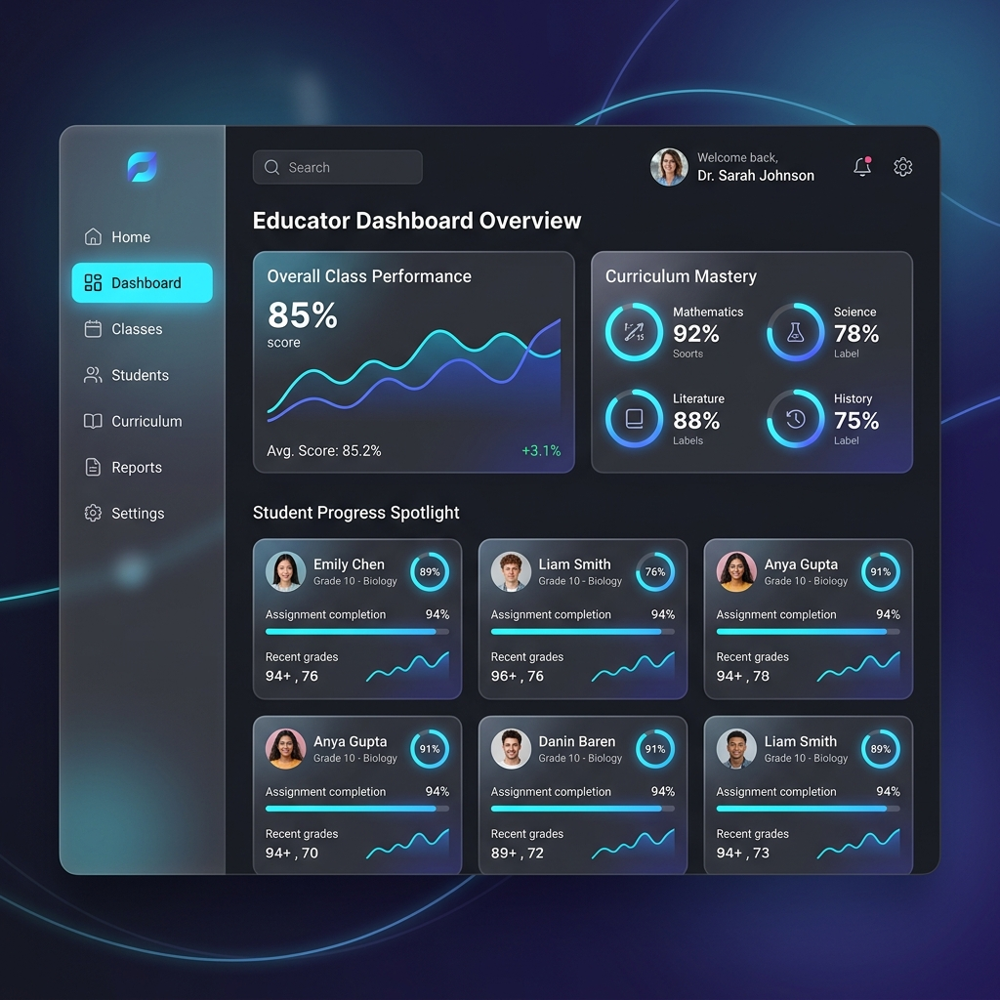
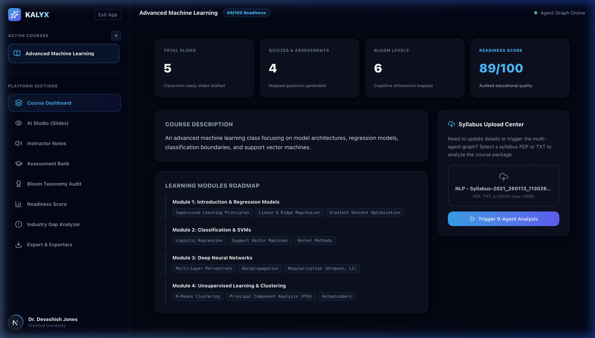
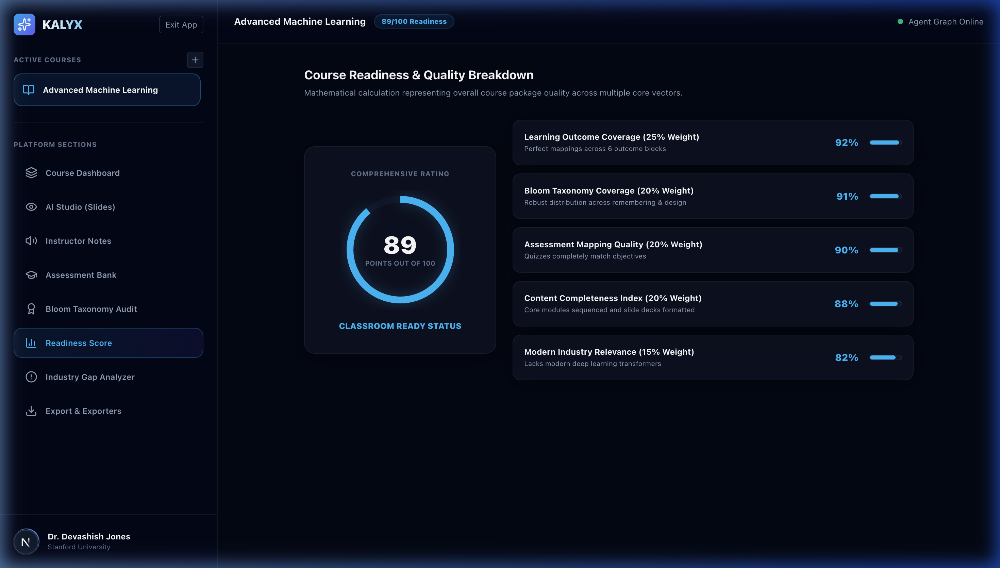
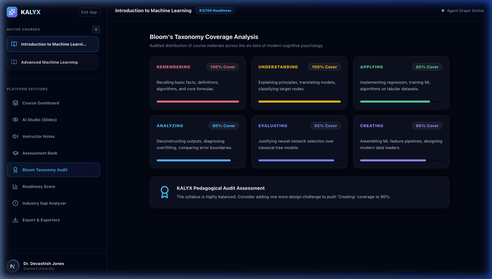
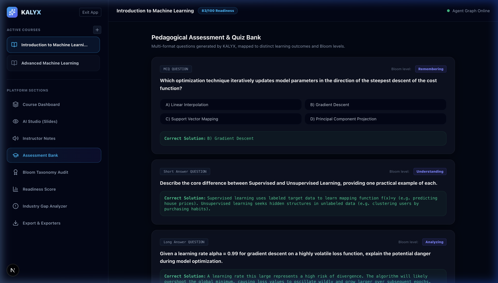
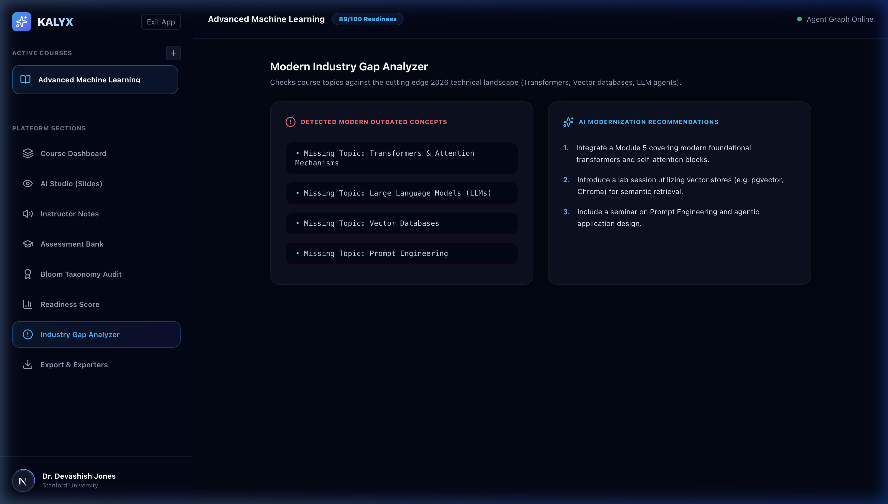

# ✨ KALYX: AI-Powered Course Content Generator

KALYX is an enterprise-grade multi-agent curriculum intelligence platform designed for modern educators, academic directors, and training organizations. By orchestrating a pipeline of **9 specialized LangGraph agents** powered by **Groq API (Llama models)**, KALYX transforms a raw syllabus document (PDF/TXT) into a comprehensive, production-ready classroom package in minutes.

The platform automatically builds structured lesson outlines, slide content, instructor lecture scripts, question banks, cognitive audits, and modern industry gap analysis, exporting everything directly to premium PPTX slide decks, PDFs, Word documents, and interactive quizzes.

---

## 📸 Platform Snapshots

### 1. Premium Educator Dashboard


### 2. Interactive AI Studio & Canvas Editor


### 3. Curriculum Readiness Breakdown (Explain Score)


### 4. Bloom's Taxonomy Cognitive Audit


### 5. Multi-Tier Assessment & Quiz Bank


### 6. Silicon Valley Industry Gap Analyzer


---

## 🚀 Key Features

### 1. Intelligent Multi-Agent Workflow (9-Agent Loop)
KALYX features a structured multi-agent state graph pipeline powered by **LangGraph** and **Groq API (Llama models)**:
1. **Curriculum Analysis Agent**: Extracts metadata, prerequisites, and core learning goals from the raw syllabus document.
2. **Learning Outcome Agent**: Generates measurable outcome statements mapped directly to Bloom's Taxonomy cognitive levels.
3. **Curriculum Planning Agent**: Expands course topics into a complete weekly lesson plan (up to 30 weeks of teaching structure).
4. **Slide Generation Agent**: Generates slide titles, bullet points, code blocks, and visual companion descriptions in batched loops.
5. **Instructor Notes Agent**: Generates deep, slide-specific lecture scripts, talking points, and classroom examples.
6. **Assessment Agent**: Generates high-quality multiple choice questions (MCQs) mapped directly to target learning outcomes.
7. **Bloom Audit Agent**: Audits the alignment between learning outcomes and generated questions.
8. **Industry Gap Agent**: Compares course content to modern industry trends, identifying missing topics and suggesting integrations.
9. **Readiness Score Agent**: Synthesizes all audits and files into a unified course readiness score (0-100%) and comments.

### 2. Self-Healing Cognitive Loop
If the **Bloom Audit Agent** audits the average Bloom cognitive coverage below a **75% threshold**, the LangGraph orchestrator triggers a conditional edge that loops back to the *Curriculum Planning* stage. This enriches the syllabus content and updates outcomes dynamically before finalizing the package.

### 3. Learning Outcome Traceability
Educators can click on any extracted learning outcome inside the traceability dashboard to view exactly how it is covered across the generated course. The platform maps outcomes directly to:
* Relevant generated slides
* Instructor lecture scripts and talking points
* Target assessment questions
* Overall coverage completeness percentages

### 4. Interactive Studio Workspace
The workspace provides an interactive slide canvas, markdown speaker notes editor, and customizable quiz bank. Instructors can refine text, adjust teaching tips, customize slide layouts, and update visual suggestions on the fly with automatic database synchronization.

### 5. Premium Slide Exports (PPTX & PDF)
* **PowerPoint Deck**: Generates startup-grade dark-navy theme presentation slides (`#0a0f1e` dark theme, `#0ea5e9` cyan accents) with programmatically fetched relevant stock photos, terminal formatting for code snippets, dynamic font scaling to prevent overflow, and bound speaker notes.
* **FPDF2 PDF Package**: Generates classroom implementation booklets including custom cover pages, metadata profiles, section dividers, side-by-side illustrated slide panels, and quiz answer keys.

---

## 🛠️ Technical Architecture

```mermaid
graph TD
    %% Frontend Block
    subgraph Frontend [Next.js 15 SPA]
        FE_Landing[Landing Page]
        FE_Studio[Interactive AI Studio]
        FE_Trace[Traceability Dashboard]
        FE_Timeline[Execution Pipeline Panel]
    end

    %% Backend Block
    subgraph Backend [FastAPI Server]
        BE_Auth[JWT Auth Router]
        BE_Course[Course Manager Router]
        BE_Studio[Studio Mutator Router]
        BE_Export[Export Generator Router]
        BE_RAG[RAG Vector Index Builder]
    end

    %% Storage Block
    subgraph Storage [SQLite Database]
        DB_User[(users)]
        DB_Course[(courses & syllabi)]
        DB_Slides[(generated_slides)]
        DB_Notes[(instructor_notes)]
        DB_Embeds[(embeddings vector index)]
    end

    %% Orchestration Block
    subgraph Orchestration [LangGraph Orchestrator]
        AG_Graph[9-Agent State Graph]
        AG_Groq[Groq API (Llama)]
    end

    %% Interconnections
    FE_Landing -->|API Requests| BE_Auth
    FE_Studio -->|API Requests| BE_Course
    FE_Studio -->|Mutations| BE_Studio
    FE_Trace -->|Fetch Data| BE_Course
    FE_Timeline -->|Log Traces| BE_Course
    
    BE_Auth --> DB_User
    BE_Course --> DB_Course
    BE_Studio --> DB_Slides
    BE_Studio --> DB_Notes
    BE_RAG --> DB_Embeds
    
    BE_Course -->|Orchestrate| AG_Graph
    AG_Graph -->|LLM Queries| AG_Groq
```

---

## ⚡ Setup & Installation

### Backend Setup (FastAPI)

1. Navigate to the backend directory:
   ```bash
   cd backend
   ```

2. Create a virtual environment and activate it:
   ```bash
   python3 -m venv venv
   source venv/bin/activate
   ```

3. Install required dependencies:
   ```bash
   pip install -r requirements.txt
   ```

4. Configure environment variables. Create a `.env` file inside the `backend` folder:
   ```env
   DATABASE_URL=sqlite:///./kalyx.db
   JWT_SECRET=supersecret_key_change_me_in_production
   JWT_ALGORITHM=HS256
   GROQ_API_KEY=your-groq-api-key-here
   GROQ_MODEL=llama-3.1-8b-instant
   ```

5. Run the backend development server:
   ```bash
   uvicorn app.main:app --reload --port 8000
   ```

### Frontend Setup (Next.js)

1. Navigate to the frontend directory:
   ```bash
   cd frontend
   ```

2. Install dependencies:
   ```bash
   npm install
   ```

3. Run the frontend development server:
   ```bash
   npm run dev
   ```

4. Open your browser and navigate to `http://localhost:3000` to access the KALYX platform.

---

## 🔒 Production Hardening & Security

* **Rate Limiting**: Sliding-window, dependency-free rate limiters protect sensitive routes:
  * `/api/auth/login` (10 req/min/IP)
  * `/api/auth/signup` (5 req/min/IP)
  * `/api/courses/` (20 req/min/user)
  * Syllabus uploads & analyze (5 req/min/user)
* **Payload Validation**: Strict checks on input files, course titles, description lengths, and PDF formats. Returns clean, structured JSON 422/429 validation outputs.
* **Local Fallbacks**: Local embedding vector indexing and mock agent fallbacks guarantee that the application compiles successfully even during offline sessions or Groq API outages.

---

## 📄 License
This project is proprietary and confidential. Created as part of the KALYX Curriculum Intelligence Platform.
